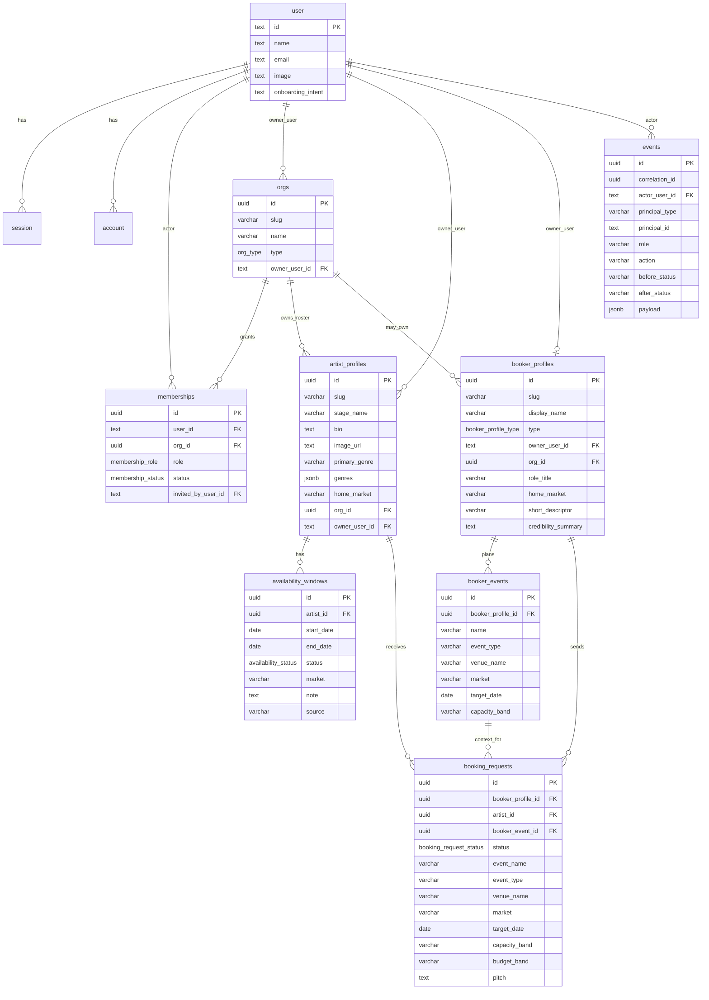

# Current ERD and Domain Gap Map

Date: 2026-06-26

This document records the implemented database shape as of the current workflow branch, then maps it against the foundation model in `docs/foundation/02-domain-model.md`, `docs/foundation/07-roster-org-rbac.md`, `docs/foundation/08-profiles-pitches-discovery.md`, and `docs/foundation/09-system-architecture.md`.

## Current Implemented ERD

## Intended Domain Shape

The foundation docs make one rule load-bearing: `User` is the authenticated actor, not the product identity and never the deal counterparty. Deals bind principals: `ArtistProfile`, `BookerProfile`, and `Org`. Authority is evaluated through active `Membership`s over the relevant principal or owning `Org`.

The intended user experience follows from that:

- An account hub should show the principals and workspaces the actor can act through.
- An `Org` is the workspace container; it can manage artists, book talent as a venue/promoter/festival, or do both.
- A `BookerProfile` is the demand-side principal shown to artist teams when a request lands.
- A `BookingRequest` ties a booker principal to an artist principal, plus event/pitch context.
- Artist public/search surfaces must use a controlled projection and avoid raw availability, private floors, legal names, payment data, and actor identities.

## Current Drift

| Area | Current implementation | Intended model |
| --- | --- | --- |
| Account routing | `/account` presents team and booker dashboards to every signed-in user. | Account should list actual principals/workspaces available to the actor. |
| User role | `user.onboarding_intent` stores a binary artist/booker preference. | A user can act for multiple principals at once; intent is not authority. |
| Booker profile | `booker_profiles.owner_user_id` is required and unique, and creation always makes an individual profile. | A booker can be personal or `Org`-backed; one `Org` can own multiple buyer faces. |
| Org shape | `Org` exists, but the UI largely treats it as artist-team-only. | `Org` is a workspace that can be supply-side, demand-side, or both. |
| Artist ownership | `artist_profiles.owner_user_id` still drives direct ownership checks alongside `org_id`. | User ownership is temporary scaffolding; new self-managed artists should be one-person orgs. |
| Booker dossier | Current fields are display name, role title, home market, descriptor, and credibility summary. | Booker onboarding needs principal type, logo/media, website/socials, affiliation, track record, and later verification/payment gates. |
| Public projection | Public artist pages/cards include `home_market` and availability preview details. | Public/search projection must be deliberate and should avoid sensitive booking/location/calendar internals unless intentionally exposed. |
| Draft privacy | `booking_requests` stores `draft` and `request_sent` rows with `artist_id`; artist-team inbound query currently selects all statuses. | Drafts belong only to the booker principal until sent; artist teams should see only sent/visible request states. |

## Recovery North Star

Do not add more side-specific buttons on top of the current account page. The next implementation should introduce a workspace/principal selector, make account state derive from `Membership`s and `BookerProfile`s, and route onboarding into creating or joining a principal.
