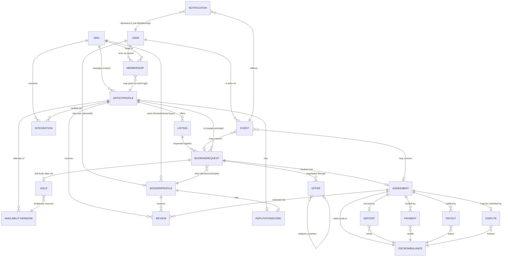

# 02 — Domain Model & Glossary (the spine)

> This is the **spine**. Every other foundation doc references the entities, terms, and invariants defined here. If a term is used anywhere in `docs/foundation/`, its canonical definition lives in this file's [Glossary](#glossary). When code is eventually written (Phase 1+, see `12-roadmap-risks-open-questions.md`), table names, type names, and API nouns must match the **ubiquitous language** below exactly — no synonyms, no drift.
>
> Scope of this doc: *what the entities are, how they relate, and the rules that must always hold.* The **behavior** of these entities lives in sibling docs:
> - Verification rules for `ArtistProfile`/`BookerProfile`/`Membership` → `03-trust-verification.md`
> - Money mechanics for `Deposit`/`EscrowBalance`/`Payment`/`Payout`/`Dispute` → `04-payments-escrow-disputes.md`
> - The deal **state machine** that drives `BookingRequest`/`Offer`/`Agreement` → `05-negotiation-deal-lifecycle.md`
> - Calendar semantics for `AvailabilityWindow`/`Hold` and the confirmation artifact → `06-availability-confirmation.md`
> - `Org`/`Membership` roles and permissions (RBAC) → `07-roster-org-rbac.md`
> - `ArtistProfile`/`BookerProfile`/`Pitch`/discovery → `08-profiles-pitches-discovery.md`
> - Where these entities live as bounded contexts → `09-system-architecture.md`

---

## 0. The one decision that shapes everything: **actor vs principal**

Read this section before anything else. It is the load-bearing modeling decision of the entire platform.

In a naive marketplace, "the user who clicks the button" *is* "the party to the deal." That assumption is **false** for the represented-artist tier. The person operating the account is almost never the person whose name, reputation, and money are on the line:

- A **manager** sends a booking confirmation **on behalf of** the artist *Prince*.
- An **agent** at an agency counter-offers **on behalf of** three different artists on their roster.
- A **festival's talent buyer** sends a request **on behalf of** the festival org, not as a private individual.

So we split every meaningful action into two coordinates:

| Coordinate | Question it answers | Who/what it is |
| --- | --- | --- |
| **Actor** | *Who physically did this?* | A `User` — an authenticated human with a login. Always accountable in the audit log. |
| **Principal** | *Whose name / money / reputation does this bind?* | The party the action is **attributed to**: an `ArtistProfile`, a `BookerProfile`, or an `Org`. |

The link between them — "this actor is **allowed** to act for this principal" — is the `Membership` (for `Org`/`ArtistProfile` principals) or direct ownership (for a personal `BookerProfile`). Authorization is *always* a check of the form: **"Does actor A have a Membership granting role R over principal P that permits action X?"**

### Why this is the keystone (not over-engineering)

Modeling actor-vs-principal explicitly is what makes four hard requirements from `init-jot` collapse into trivial, falls-out-naturally consequences instead of bolt-on features:

1. **Roster management** — "a manager/label with multiple artists wants to group/coordinate them." → An `Org` is the principal; each artist is an `ArtistProfile` linked to that `Org`; the manager is one `User` with one `Membership` covering the whole roster. No per-artist logins, no shared passwords.
2. **Multi-artist coordination** — "the same booker wants to book different artists from the same team." → All those artists share an `Org`; a booker browsing them sees they're under one team; requests can be coordinated at the `Org` level.
3. **Avoid duplicate requests to the same team** — "avoid extra complications of having multiple requests for the same team." → Because the **principal** of an inbound request resolves to an `Org`, the system can dedup / co-route at the team boundary (see `BookingRequest` and Invariant **I-12**).
4. **Accountability without conflation** — when *Prince* is "confirmed," the public artifact names the **principal** (*Prince*), while the audit log records the **actor** (the manager `User` who clicked). Reputation accrues to the principal; accountability sticks to the actor.

> **Rule of thumb for the whole codebase:** a `User` *never* appears as a counterparty on a deal. The counterparties on every `BookingRequest`, `Offer`, `Agreement`, and `Payment` are **principals** (`ArtistProfile` side and `BookerProfile`/`Org` side). The `User` only ever appears as the `actor` on an event in the audit log.

```
            ┌─────────┐   acted-as / on-behalf-of    ┌────────────────┐
   login →  │  User   │ ───────────────────────────► │   PRINCIPAL    │
 (the actor)│ (actor) │      via Membership/owns      │ ArtistProfile  │
            └─────────┘                                │ BookerProfile  │
                 │                                     │ Org            │
                 │ accountable in audit log            └────────────────┘
                 ▼                                              │
          every state transition                               │ counterparty
          records (actor, principal, role)            on every deal artifact
```

---

## 1. Entity catalog (ubiquitous language)

Entities are grouped by **bounded context** — the same **nine** contexts used in `09-system-architecture.md`: `identity`, `verification`, `catalog`, `booking`, `payments`, `reputation`, `messaging`, `notifications`, `integrations`. **`verification` is a cross-cutting context:** its *state* hangs off `User`/`Org`/`ArtistProfile`/`Membership` (which live in `identity`/`catalog` below), but its *behavior, provenance records, and external claim sources* are **operated by a dedicated `verification` module** in `09` — see `03-trust-verification.md`. Each entity lists its purpose and its key relationships. Field lists are **illustrative of the model, not a schema** — this is a planning doc, not a migration.

### 1.1 Identity & Org context (`identity`)

#### `User` / `Account`
The authenticated human. The **actor**, never a principal/counterparty. One real person → one `User`.
- **Holds:** credentials, contact, global platform role (`member` vs `staff`/admin), identity-verification status (KYC via Stripe Identity/Persona — see `03-trust-verification.md`).
- **Key relationships:** has many `Membership`s (one per principal it can act for); may **own** a personal `BookerProfile`; is the `actor` on every `Event` in the audit log.
- **Note:** "Account" and "User" are the **same entity** — we standardize on **`User`** in code; "account" is used colloquially in UX copy only.

#### `Org` *(Agency / Label / Management)*
A team principal: an agency, record label, management company, festival, venue group, or promoter. The container that makes roster management and team-level dedup work.
- **Holds:** legal name, type (`agency` | `label` | `management` | `festival` | `venue` | `promoter`), KYB status (see `03`), default `BookerProfile` and/or `ArtistProfile` ownership.
- **Two faces:** an `Org` can be a **supply-side** principal (it manages a roster of `ArtistProfile`s), a **demand-side** principal (it has a `BookerProfile` and buys talent — e.g., a festival), or **both**.
- **Key relationships:** has many `Membership`s (its team); owns many `ArtistProfile`s (roster); may own one or more `BookerProfile`s.

#### `Membership` *(the on-behalf-of grant)*
The join entity that authorizes an **actor** (`User`) to act for a **principal** (`Org` or directly an `ArtistProfile`). This is the literal encoding of "acting on-behalf-of."
- **Holds:** `user_id`, `principal_ref` (`Org` or `ArtistProfile`), **`role`** (see role enum below), status (`invited` | `active` | `suspended` | `revoked`), the inviting/vouching member (used by the verification **counter-signature** path in `03`).
- **Role enum (v1):** `owner` · `agent` · `finance` · `viewer`. Full permission matrix lives in `07-roster-org-rbac.md`; this doc only fixes the *names*.
- **Key relationships:** belongs to one `User` and one principal. Grants a scope of permitted actions over that principal.

> **Why `Membership` is its own entity and not a column:** a `User` can have *different roles over different principals simultaneously* — `finance` for Label A, `agent` for Artist B (a side roster), `viewer` for Festival C. Roles are per-(actor, principal) pairs, which is exactly a join table with a role.

### 1.2 Catalog / supply (`catalog`)

#### `ArtistProfile`
The **supply-side principal** — the bookable act. *This is "Prince."* An act, not a person: a band, a DJ, a solo performer.
- **Holds:** stage name, bio/EPK media, genre tags, home market, **verification provenance** (e.g., "Verified via Spotify for Artists" — see `03-trust-verification.md`), public reputation summary (denormalized from `ReputationScore`).
- **Ownership:** owned by an `Org` (the managing team) **or** self-managed (owned via a `Membership` held directly by the artist's own `User`). Either way, *requests target the `ArtistProfile`, and the resolved team answers.*
- **Key relationships:** belongs to an `Org` (or is self-managed); has many `Listing`s; has an `AvailabilityWindow` calendar; is the artist-side counterparty on `BookingRequest`/`Offer`/`Agreement`/`Payment`; accrues `Review`s and a `ReputationScore`.

#### `Listing`
What an artist is *offering to be booked for*, with the money terms. The unit a booker discovers and requests against. An `ArtistProfile` can have several (e.g., "Full live band," "DJ set," "Festival headline").
- **Holds:**
  - **`fee`** — the public/asking booking fee (or fee range).
  - **`private_floor`** — the hidden minimum the team will accept. **Never exposed to bookers.** Drives auto-decline / nudge logic in `05-negotiation-deal-lifecycle.md`.
  - **`availability_policy`** — how this listing maps onto the calendar (which `AvailabilityWindow`s it's bookable in, blackout rules, lead-time minimums, travel/radius constraints).
  - configuration: set type, expected set length, rider references (technical + hospitality), deposit percentage default (industry norm ~50% — see `04`).
- **Key relationships:** belongs to one `ArtistProfile`; referenced by `BookingRequest`s; its `private_floor` is consulted by the negotiation engine.

> **Modeling note:** `private_floor` lives on `Listing`, **not** on `Offer`. The floor is a standing policy of the supply side; offers are concrete numbers exchanged. Keeping the floor on the listing is what lets the platform auto-decline a below-floor offer *without a human ever seeing it* and *without leaking the number*.

#### `AvailabilityWindow`
A span of calendar time describing whether/when an `ArtistProfile` (via a `Listing`) can be booked. The substrate for double-booking prevention. Detailed semantics (tentative vs confirmed, ICS, time zones) are in `06-availability-confirmation.md`; here we fix the entity and its relationship to `Hold`.
- **Holds:** date/time span, market/region, status (`open` | `held` | `blocked` | `booked`), source (manual vs integration-synced).
- **Key relationships:** belongs to an `ArtistProfile`; can be consumed by a `Hold`; transitions to `booked` when an `Agreement` is `Confirmed`.

#### `Hold`
A **tentative, time-boxed reservation** of an `AvailabilityWindow` — the soft-lock that prevents two bookers from racing for the same date while a deal is being negotiated. A hold is *not* a confirmed booking and never auto-converts (per `init-jot`: confirmation is always explicit).
- **Holds:** the held `AvailabilityWindow`, the `BookingRequest` it backs, expiry timestamp, hold strength (`soft` | `deposit-backed` — a deposit-backed request holds harder; see `04`), **status** (`active` | `pending_confirmation` | `promoted` | `expired` | `released` — lifecycle owned by `06`).
- **Key relationships:** belongs to one `BookingRequest`; consumes one `AvailabilityWindow`; released on request expiry/decline; promoted to `booked` on confirmation.

### 1.3 Demand / discovery (`catalog` ↔ demand)

#### `BookerProfile`
The **demand-side principal** — who's doing the booking, as seen by an artist sizing up a request. Answers the `init-jot` requirement that "when an artist receives a request they can gain an initial grasp of who the booker is."
- **Holds:** display name, type (`individual` | `org-backed`), affiliation (links to an `Org` for festivals/venues/promoters), track record summary, verification/KYC-KYB status (see `03`), public reputation summary.
- **Ownership:** owned by a `User` directly (independent buyer) **or** by an `Org` (festival/venue talent buyer acts via an `Org`-owned `BookerProfile`).
- **Key relationships:** is the booker-side counterparty on `BookingRequest`/`Offer`/`Agreement`/`Payment`; accrues `Review`s and a `ReputationScore`; may belong to an `Org`.

### 1.4 Deal / booking (`booking`)

> These five entities are the **transaction core**. Their *lifecycle and transitions* are owned by `05-negotiation-deal-lifecycle.md`; this doc defines their *shape and relationships* only. The canonical deal state machine ( `Draft → Request sent → Offer/Counter loop → Accepted → Contract e-signed → Deposit captured → Confirmed → Performed → Settled → Reviewed`, with `Expire/Cancel/Dispute` branches) is reproduced and authoritative there.

#### `BookingRequest`
A booker's inbound ask to book an artist's `Listing` for a specific date/event, carrying the **pitch**. The root object of a deal thread.
- **Holds:**
  - `booker_principal` (a `BookerProfile`), `artist_principal` (an `ArtistProfile`), `listing_ref`, target date(s).
  - **`pitch`** — structured + free-text description of the event ("what the specific event or thing is"): event name, venue, capacity, date, set details, billing, supporting context. *Pitch is part of the request, not a separate top-level entity.*
  - optional **deposit hold reference** — serious requests can require an escrowed deposit hold at send time (the "money as spam filter" mechanism; see `03`/`04`).
  - resolved **team routing**: the `Org` (if any) the `artist_principal` belongs to, for dedup/co-routing (Invariant **I-12**).
  - current deal `status` (mirrors the state machine in `05`).
- **Key relationships:** ties together a `BookerProfile` and an `ArtistProfile`; spawns one `Hold`; accumulates `Offer`s; resolves into at most one `Agreement`.

#### `Offer` / `CounterOffer`
A concrete money-and-terms proposal within a `BookingRequest` thread. We model **one entity, `Offer`**, with a `direction` (`from_booker` | `from_artist`) and a `replaces` link to the prior offer — a "counter-offer" is simply an `Offer` whose `replaces` points at the offer it answers. (One entity, not two, keeps the negotiation history a clean linked list.)
- **Holds:** amount, deposit %, terms delta (date, set length, rider exceptions), `direction`, `replaces` (prior `Offer`), status (`open` | `accepted` | `superseded` | `withdrawn` | `expired` | `auto_declined`).
- **Floor interaction:** an inbound `from_booker` offer below the `Listing.private_floor` may be `auto_declined` or nudged *without notifying the team and without revealing the floor* (logic in `05`).
- **Key relationships:** belongs to one `BookingRequest`; forms a chain via `replaces`; an `accepted` `Offer` is the term-source for the `Agreement`.

#### `Agreement` / `Contract`
The binding deal artifact created when an `Offer` is accepted: the negotiated terms, frozen, plus the **e-signed contract**. "Agreement" = the platform's structured record; "Contract" = the rendered, e-signable document (Dropbox Sign / DocuSign — vendor TBD, see open questions in the blueprint and `04`).
- **Holds:** frozen terms (amount, deposit %, date, riders, cancellation policy), e-sign envelope reference + status (`drafted` | `out_for_signature` | `signed_artist` | `signed_booker` | `fully_executed`), generated contract document reference, link to the `EscrowBalance`.
- **Authority note:** the platform **generates** the contract and is **not** the legal authority (a non-goal in `01-vision-strategy.md`). Signatures are attributed to **principals** but performed by **actors** with the right `Membership` role (e.g., `owner`/`agent`).
- **Key relationships:** belongs to one `BookingRequest`; sourced from one accepted `Offer`; has one `EscrowBalance`; produces `Payment`/`Payout` flows; can spawn a `Dispute`.

### 1.5 Money (`payments`)

> Money entities are **shapes only** here. The mechanism — Stripe Connect separate charges & transfers, delayed/manual payouts as license-free escrow, release timers, refund/chargeback interaction — is owned by `04-payments-escrow-disputes.md`. showman never custodies funds; **Stripe is the money-transmitter**.

#### `Deposit`
The up-front portion (industry norm ~50%) that secures the date, captured at the **`DepositCaptured`** deal state — after the `Contract` is **fully executed** and **before** `Confirmed`, so the confirmation artifact never lights up on unfunded money (ordering owned by `05`; mechanism by `04`).
- **Holds:** amount, % of fee, capture state, the `Payment` that funded it, link to `EscrowBalance`.
- **Key relationships:** part of an `Agreement`'s money plan; funds the `EscrowBalance`.

#### `EscrowBalance`
The **held** funds for a deal, segregated by Stripe, not yet released to the artist. The ledger object that answers both fairness fears in `init-jot`:
- booker can't pay deposit then ghost → the **balance is escrowed before the show**;
- artist isn't trapped by a false dispute → funds **auto-release after a post-show window unless an in-window, evidence-backed `Dispute` lands**.
- **Holds:** total held, composition (deposit + balance), release-eligible timestamp, release state (`holding` | `fully_funded` | `release_pending` | `released` | `refunded` | `frozen_by_dispute`). `fully_funded` = both deposit **and** balance captured (the I-16 "escrowed before performance" state); substate options are in `04 §7`.
- **Key relationships:** one per `Agreement`; funded by `Payment`s; drained by a `Payout` (to artist) or refund (to booker).

> **Refund resolution (canonical):** there is intentionally **no separate `Refunded` *deal* status**. A refund-to-booker outcome is represented as deal **`Cancelled`** + `EscrowBalance: refunded`. `04`/`05`/`12` reference this decision rather than re-deferring it.

#### `Payment`
A money-in event from a booker (deposit, then balance). Maps to a Stripe charge/PaymentIntent.
- **Holds:** amount, payer (`BookerProfile`), Stripe reference, purpose (`deposit` | `balance`), state.
- **Key relationships:** funds an `EscrowBalance`; belongs to an `Agreement`.

#### `Payout`
A money-out event to the artist side on release. Maps to a Stripe transfer/payout to the artist's (or managing `Org`'s) connected account.
- **Holds:** amount, payee (the artist-side connected account — resolved via the managing `Org` or self-managed `ArtistProfile`), platform take-rate deducted (see `01`), Stripe reference, state.
- **Key relationships:** drains an `EscrowBalance`; belongs to an `Agreement`. **Payee resolution honors actor-vs-principal:** funds go to the *principal's* connected account (artist/`Org`), even though an *actor* triggered/approved the action.

### 1.6 Resolution, reputation, comms (`reputation`, `messaging`, `notifications`, `integrations`)

#### `Dispute`
A contested deal raised within the fixed post-performance window, freezing the `EscrowBalance` until resolved. Model is Airbnb-Resolution-Center-style but tightened (windowed, evidence-based, structured outcomes) — full flow in `04-payments-escrow-disputes.md`.
- **Holds:** opener (which principal), reason code, evidence attachments, state (`open` | `under_review` | `resolved_release` | `resolved_refund` | `resolved_split` | `escalated`), adjudication outcome, link to frozen `EscrowBalance`.
- **Key relationships:** belongs to one `Agreement`; freezes its `EscrowBalance`; adjudicated by platform `staff`; feeds `ReputationScore` (dispute rate).

#### `Review` / `ReputationScore`
Two-sided post-deal feedback (`Review`) and the derived, denormalized trust signal (`ReputationScore`) used in discovery ranking and as an anti-spam/quality input.
- **`Review`:** author principal, subject principal, rating, text, the `Agreement` it's tied to (reviews require a completed deal — no review without a transaction, an anti-spam invariant).
- **`ReputationScore`:** per-principal derived metrics — completion rate, dispute rate, response time, two-sided rating — recomputed from `Review`s, `Agreement` outcomes, and `Dispute` history. Behavior/ranking use in `08-profiles-pitches-discovery.md` and `03-trust-verification.md`.
- **Key relationships:** `Review` belongs to an `Agreement` and targets a principal; `ReputationScore` is one-per-principal, derived.

#### `Notification`
A delivered alert about a state transition (request received, offer countered, contract ready, deposit captured, **"Prince is confirmed for [event]"**, payout released, dispute opened). Every state transition is an `Event`; notifications are one consumer of those events.
- **Holds:** recipient `User`(s) (resolved from the principal's `Membership`s), channel (`in_app` | `email` | `push`), the `Event` it reflects, read/delivery state.
- **Key relationships:** fan-out target is the **principal's team** — i.e., resolved through `Membership` (notify all `User`s who can act for the affected principal, filtered by role/preference). This is another place actor-vs-principal pays off: a confirmation notifies *the team*, not just whoever clicked.

#### `Integration`
A connection to an external system — **inbound** for verification/identity (Spotify for Artists, Apple/Meta/YouTube OAuth claim; Stripe Identity/Persona) and **outbound** for team workflows (email, Slack, calendar/ICS). Lets festivals/labels run coordination at scale (an `init-jot` ask).
- **Holds:** owning principal (`Org`/`ArtistProfile`/`BookerProfile`), provider, direction (`verification_source` | `notification_sink` | `calendar_sync`), credentials/token refs (secrets handling per `09-system-architecture.md`), status.
- **Key relationships:** belongs to a principal; **verification_source** integrations feed provenance into `03-trust-verification.md`; **calendar_sync** integrations populate `AvailabilityWindow`s; **notification_sink** integrations are channels for `Notification` fan-out.

#### `Event` *(audit log)* — cross-cutting
Not in the blueprint's headline list, but **required by the model**: every state transition is an immutable `Event` recording `(actor: User, principal, role, action, before→after, timestamp, correlation_id)`. It is the single seam for the deal state machine (`05`), notifications, integrations, dispute evidence, and authority audit. This is where actor-vs-principal is *recorded for all time*.

### 1.7 Downstream-amended entities

Per the consistency obligation (§5), these are **defined in sibling docs but registered here** so the spine stays the single source of truth — the spine reserves the name, the owning doc holds the behavior.

- **`BookingGroup`** *(`booking`; owner `07-roster-org-rbac.md`)* — a **lightweight coordination context** tying together several **co-routed** `BookingRequest`s for multiple `ArtistProfile`s under one `Org` (the "book the whole team together" case, Invariant **I-12**) **without fusing them** — each artist keeps its own `Offer`/`Agreement`/`EscrowBalance`/confirmation. A heavyweight all-or-nothing bundle is explicitly **rejected** for v1 (Phase-2 candidate, `12` OQ-20). *(Supersedes the rejected `BookingBundle` name in §6.)*
- **`ProfileMedia`** *(`catalog`; owner `08-profiles-pitches-discovery.md`)* — an EPK media asset (audio/video/image/press) on an `ArtistProfile`.
- **`BookingCredit`** *(`catalog`; owner `08`)* — a verified past-show credit on an `ArtistProfile` (track record), distinct from a `Review`.
- **`ReputationSummary`** *(`reputation`; owner `08`)* — the denormalized, display-ready projection of `ReputationScore` consumed by discovery/profile surfaces; a **read-model**, not a new source of truth.
- **Pitch / EPK value-objects** *(owner `08`)* — `PitchTemplate`/`PitchAttachment` (composition around the embedded `Pitch`) and EPK presentation value-objects (`FeeDisplay`, `ResponseProfile`). Sub-structures of existing entities (`Pitch` stays embedded on `BookingRequest`), **not** new top-level entities.

---

## 2. Entity-relationship diagram



> **Diagram reading notes:**
> - `MEMBERSHIP.principal_ref` is polymorphic — it points at an `ORG` *or* directly at an `ARTISTPROFILE` (self-managed artists). Mermaid `erDiagram` can't express polymorphic FKs cleanly, hence the two relationship lines into `MEMBERSHIP` plus this note.
> - `BOOKERPROFILE` is owned by **either** a `USER` (personal) **or** an `ORG` (org-backed) — the two `o|`/`o{` lines. Exactly one owner (Invariant **I-3**).
> - Counterparties on every deal artifact are **principals** (`ARTISTPROFILE`, `BOOKERPROFILE`/`ORG`), never `USER`. `USER` appears only as the actor on `EVENT` and the recipient of `NOTIFICATION`.

---

## 3. Glossary

The canonical ubiquitous language. Use these exact terms everywhere — docs and (later) code. Synonyms in the right column are what to **avoid**.

| Term | Definition | Avoid / not the same as |
| --- | --- | --- |
| **Actor** | The authenticated `User` who performed an action. Accountable in the audit log. | Not the "party"/"counterparty" — that's the principal. |
| **Principal** | The party an action is attributed to: an `ArtistProfile`, `BookerProfile`, or `Org`. Whose name/money/reputation is bound. | Not the `User`. |
| **On-behalf-of (OBO)** | An actor performing an action attributed to a principal, authorized by a `Membership`. | "Impersonation" (implies no authority); "delegate" (too weak). |
| **User / Account** | The single human-login entity. Standardize on **`User`** in code. | Two separate things — they are one. |
| **Org** | A team principal: agency, label, management, festival, venue, promoter. Can be supply-side, demand-side, or both. | "Company"/"team account" — use `Org`. |
| **Membership** | The (actor → principal) grant carrying a **role**. The literal "on-behalf-of" link. | A boolean "is_admin" flag — roles are per-principal. |
| **Role** | The permission level on a `Membership`: `owner` · `agent` · `finance` · `viewer`. Matrix in `07`. | Global roles — roles are per-(actor, principal). |
| **ArtistProfile** | The supply-side principal — the bookable act ("Prince"). | "Artist user" — an act is owned/operated, not logged-in. |
| **BookerProfile** | The demand-side principal — who's booking, as the artist sees them. | "Buyer account" — it's a principal, not a login. |
| **Listing** | An offer-to-be-booked with money terms: **`fee`**, **`private_floor`** (hidden), **`availability_policy`**. | "Gig"/"service" — and the floor is never on the Offer. |
| **fee** | The public asking booking fee/range on a `Listing`. | "price" (ambiguous with offer amount). |
| **private_floor** | The hidden minimum the supply side accepts; drives auto-decline/nudge. **Never exposed.** | "reserve" shown to bookers — it is invisible. |
| **availability_policy** | Rules mapping a `Listing` onto the calendar (windows, blackouts, lead time, radius). | The calendar itself — that's `AvailabilityWindow`s. |
| **AvailabilityWindow** | A calendar span with a bookable status for an `ArtistProfile`. | "free slot" — windows have status + source. |
| **Hold** | A tentative, time-boxed, **never auto-converting** soft-lock on a window backing a request. | "Booking"/"reservation" — a hold is not confirmed. |
| **BookingRequest** | A booker's inbound ask against a `Listing`, carrying the **pitch**. Root of a deal thread. | "Inquiry"/"lead" — it's the typed root object. |
| **Pitch** | The structured + free-text event description carried *inside* a `BookingRequest`. | A separate top-level entity — it lives on the request. |
| **Offer / CounterOffer** | A money-and-terms proposal in a thread. One entity `Offer` with `direction` + `replaces`; a counter is an `Offer` that `replaces` another. | Two entities — it's one, chained. |
| **Agreement** | The platform's structured, frozen-terms record of an accepted deal. | The legal document itself — that's the `Contract`. |
| **Contract** | The rendered, e-signable document for an `Agreement` (vendor e-sign). | The `Agreement` record — distinct artifacts. |
| **Deposit** | The up-front securing portion (~50% norm), captured at the **`DepositCaptured`** state, **before** `Confirmed`. | "Down payment" — use `Deposit`. |
| **EscrowBalance** | Held, Stripe-segregated funds for a deal; auto-releases unless disputed. | showman "holding the money" — **Stripe** custodies. |
| **Payment** | A money-in event from a booker (deposit or balance). | "Charge" generically — it's the typed in-event. |
| **Payout** | A money-out event to the **artist-side principal's** connected account on release. | Paying "the user" — it pays the principal. |
| **Dispute** | A windowed, evidence-based contest that freezes the `EscrowBalance`. | A Stripe chargeback — distinct (interaction in `04`). |
| **Settlement window** | The fixed **post-performance** window (default 72h) during which the `EscrowBalance` auto-releases to the artist unless an in-window, evidence-based `Dispute` lands. Mechanism in `04`. | **"Confirmation window"** — never; "confirm" is the *pre-show* artifact (below). |
| **Review** | Two-sided post-deal feedback, requires a completed `Agreement`. | Unsolicited rating — no deal, no review. |
| **ReputationScore** | Per-principal derived trust signal (completion/dispute rate, ratings). | A single star average — it's multi-factor, derived. |
| **Notification** | A delivered alert about an `Event`, fanned out to a principal's **team** via `Membership`. | A raw event — notifications are delivered consumers. |
| **Integration** | An external connection: verification source, calendar sync, or notification sink. | "Plugin" — typed by direction/provider. |
| **Event (audit log)** | The immutable `(actor, principal, role, action, before→after)` record per transition. | A `Notification` — events are the source; notifications consume them. |
| **Confirmed (the artifact)** | The first-class "Prince is confirmed for [event]" object — page/card/ICS/notification, optionally public/promo. | A status flag only — it's a shareable artifact (see `06`). |

---

## 4. Core invariants

Rules that must **always** hold. Each is testable and is the contract this doc owes the rest of the foundation. `(Owner doc)` marks where the *enforcing behavior* is specified.

**Identity, authority, on-behalf-of**

- **I-1 — Actor is never a counterparty.** No `BookingRequest`, `Offer`, `Agreement`, `Payment`, `Payout`, or `Dispute` references a `User` as a party. Parties are principals only. *(this doc; enforced everywhere)*
- **I-2 — Every action is attributable.** Every state transition produces an `Event` recording `(actor, principal, role)`. There is no anonymous or principal-less mutation. *(05; audit)*
- **I-3 — One owner per principal-of-ownership.** A `BookerProfile` is owned by exactly one `User` or exactly one `Org`, never both/neither. An `ArtistProfile` belongs to exactly one `Org` *or* is self-managed via a direct `Membership` — never orphaned. *(07)*
- **I-4 — Authority gates every OBO action.** An actor may act for a principal **only** via an `active` `Membership` whose `role` permits the action. Revoking/suspending a `Membership` immediately removes the actor's authority over that principal. *(03, 07)*
- **I-5 — Identity ≠ authority.** A `User` passing KYC (identity verified) does **not** thereby gain authority over any `ArtistProfile`. Authority is a separate, explicit grant. *(03)*

**Catalog, listing, floor**

- **I-6 — The floor is invisible.** `Listing.private_floor` is never returned to a booker-side principal through any API, UI, error message, or timing side-channel. Below-floor handling must not leak the number. *(05, 08)*
- **I-7 — Floor ≤ fee.** A `Listing`'s `private_floor` must be ≤ its public `fee` (or fee-range floor). *(05)*
- **I-8 — Listing belongs to a bookable principal.** Every `Listing` belongs to exactly one `ArtistProfile`; its `availability_policy` references only that artist's `AvailabilityWindow`s. *(08)*

**Availability & confirmation**

- **I-9 — No double-booking.** An `AvailabilityWindow` in state `booked` cannot back another `Hold` or `Agreement`. Two `Confirmed` `Agreement`s can never overlap the same window. *(06)*
- **I-10 — Holds are tentative and never auto-confirm.** A `Hold` only ever becomes `booked` through an **explicit** confirm by an authorized actor (right `Membership` role) on the artist side. Calendar availability alone never auto-accepts a booking. *(06)* *(direct from `init-jot`)*
- **I-11 — Holds expire.** Every `Hold` has an expiry; on expiry it releases its `AvailabilityWindow` and any deposit-hold is voided. *(06, 04)*

**Booking & team routing**

- **I-12 — Requests resolve to the team principal.** A `BookingRequest` targeting an `ArtistProfile` resolves the managing `Org` (if any) so the platform can dedup/co-route at the team boundary — "avoid multiple requests to the same team." *(05, 07)* *(direct from `init-jot`)*
- **I-13 — One live deal per request.** A `BookingRequest` resolves into **at most one** `Agreement`. The accepted `Offer` is the sole term-source for that `Agreement`. *(05)*
- **I-14 — Offers chain, never fork.** Within a request, at most one `Offer` is `open` at a time; a new offer `supersedes` the prior via `replaces`. The negotiation history is a single linked chain. *(05)*

**Money & escrow** *(mechanism owned by `04`; these are the model-level guarantees)*

- **I-15 — showman never custodies funds.** All money movement is via Stripe; no platform-held balance exists. `EscrowBalance` reflects Stripe-segregated holds, not a showman wallet. *(04)*
- **I-16 — Balance escrowed before performance.** An `Agreement` cannot reach `Performed`/release eligibility unless the full `EscrowBalance` (deposit + balance) is funded **before** the performance date. *(04)* *(answers "booker pays deposit then ghosts")*
- **I-17 — Auto-release unless disputed in-window.** After the post-performance window with no `open` `Dispute`, the `EscrowBalance` auto-releases to the artist-side principal via a `Payout`. *(04)* *(answers "artist trapped by a false dispute")*
- **I-18 — Dispute freezes funds.** An `open` or `under_review` `Dispute` freezes its `Agreement`'s `EscrowBalance`; no `Payout` or refund occurs until the dispute resolves. *(04)*
- **I-19 — Payout follows the principal.** A `Payout` goes to the artist-side **principal's** connected account (managing `Org` or self-managed `ArtistProfile`), regardless of which actor triggered it. *(04, 07)*

**Reputation & comms**

- **I-20 — No deal, no review.** A `Review` requires a completed `Agreement` between the author and subject principals. Reviews accrue to **principals**, not actors. *(08)*
- **I-21 — Notifications fan out to the team.** A `Notification` about a principal's deal is delivered to the `User`s holding a qualifying `Membership` over that principal (filtered by role/preference), not only to the actor who triggered the underlying `Event`. *(this doc; `06` for the confirmation artifact)*

---

## 5. How this spine is used by sibling docs (cross-reference map)

| Sibling doc | Entities/terms it owns the *behavior* of | Invariants it must honor |
| --- | --- | --- |
| `03-trust-verification.md` | `User` KYC, `Org` KYB, `Membership` (counter-signature/vouch), `Integration` (verification_source), provenance on `ArtistProfile`/`BookerProfile` | I-4, I-5, I-20 |
| `04-payments-escrow-disputes.md` | `Deposit`, `EscrowBalance`, `Payment`, `Payout`, `Dispute` | I-15 … I-19 |
| `05-negotiation-deal-lifecycle.md` | the deal **state machine**; `BookingRequest`, `Offer`/`CounterOffer`, `Agreement`/`Contract`; floor logic | I-6, I-7, I-13, I-14, I-16 |
| `06-availability-confirmation.md` | `AvailabilityWindow`, `Hold`, the **Confirmed** artifact | I-9, I-10, I-11 |
| `07-roster-org-rbac.md` | `Org`, `Membership`, `role` permission matrix, ownership | I-3, I-4, I-12, I-19 |
| `08-profiles-pitches-discovery.md` | `ArtistProfile`/`BookerProfile` profiles, `Pitch`, `Review`/`ReputationScore`, discovery ranking | I-6, I-8, I-20 |
| `09-system-architecture.md` | bounded contexts these entities live in; `Event` log; webhook ingestion; secrets for `Integration` | I-2, I-15 |
| `10-design-direction-ux.md` | screens for these entities (negotiation thread, escrow status, confirmation) | I-6, I-10 |

> **Consistency obligation:** if a later doc needs a new entity, term, or to change a relationship, it must amend **this file first**, then reference it — never define a competing term locally. The `init-jot` mandate of a "modular, understandable-as-it-scales, structurally sound" system depends on this single source of truth not drifting.

---

## 6. Open modeling questions (carried, not blocking)

- **Self-managed artist mechanics.** Self-management = a direct `Membership` on the `ArtistProfile` vs. a degenerate single-member `Org`. Leaning toward "always an `Org`, even of one" to keep one code path — decide in `07-roster-org-rbac.md`.
- **`BookerProfile` ↔ `Org` cardinality.** Can one `Org` (a venue group) own *multiple* `BookerProfile`s (per-venue buyers)? Modeled as one-to-many above; confirm in `07`/`08`.
- **Pitch as sub-entity vs. embedded.** Kept embedded on `BookingRequest` for v1; revisit if pitches need independent versioning/templating (`08`).
- **`Listing` fee as scalar vs. range.** Model allows both; the negotiation engine in `05` must pick a canonical representation for floor comparison (I-7).
- **Group/multi-artist booking object.** When a booker books several artists from one `Org` "together," is that N `BookingRequest`s co-routed, or a single **`BookingGroup`** parent (now reserved in §1.7)? Defaulting to co-routed N for v1 (Invariant I-12 covers it); the `BookingGroup` bundle is a Phase-2 candidate — flagged in `07` and `12-roadmap-risks-open-questions.md`.

---

*End of 02-domain-model.md — the spine. Amend here first; reference, don't duplicate.*
