# 05 — Negotiation & Deal Lifecycle (the state machine)

> Part of the **showman** foundation doc set (`docs/foundation/`). This is the **product backbone**: the single explicit state machine that every `BookingRequest` travels through from a booker's first ask to a settled, reviewed deal.
>
> This doc **owns the behavior** of the deal entities. Their *shape and relationships* are defined in [`02-domain-model.md`](./02-domain-model.md) and are not re-derived here — `BookingRequest`, `Offer`/`CounterOffer`, `Agreement`/`Contract`, `Listing` (with `fee` and `private_floor`), `Hold`, `Deposit`, `EscrowBalance`, `Event`. Read the spine first; this doc assumes its ubiquitous language verbatim.
>
> Deliberate non-duplication — referenced, not restated:
> - The **money mechanics** behind `Deposit`/`EscrowBalance`/`Payment`/`Payout` capture and release, and the full **Dispute** flow → [`04-payments-escrow-disputes.md`](./04-payments-escrow-disputes.md). This doc treats deposit capture, escrow funding, release, and dispute as *states and guards*; doc 04 owns *how the money actually moves through Stripe*.
> - **Verification / authority** checks that gate who may act → [`03-trust-verification.md`](./03-trust-verification.md).
> - **Calendar** semantics — `AvailabilityWindow`, `Hold` strength, double-booking, and the **Confirmed artifact** ("Prince is confirmed for [event]") → [`06-availability-confirmation.md`](./06-availability-confirmation.md). This doc fires the `Confirmed` transition; doc 06 owns what the artifact *is*.
> - The **role permission matrix** (`owner`/`agent`/`finance`/`viewer`) that decides *which actor may trigger which transition on-behalf-of which principal* → [`07-roster-org-rbac.md`](./07-roster-org-rbac.md). This doc references roles by name; doc 07 is authoritative on the matrix.
> - **Pitch** structure and discovery → [`08-profiles-pitches-discovery.md`](./08-profiles-pitches-discovery.md).
> - The **`Event` log**, background jobs (timers), and webhook ingestion as architecture → [`09-system-architecture.md`](./09-system-architecture.md).

---

## 1. Why a state machine, and what it buys us

The represented-tier deal already *is* a state machine — it just runs in email, where the state lives in people's heads and inboxes. `init-jot` names the failures that come from having no shared, enforced state: unstructured offer/counter-offer with "no shared state, no audit trail, no floor logic, no expiry"; the booker who "pays the deposit, then never pays the balance"; the artist "screwed by the booker falsely disputing"; the confirmation that is "a Gmail reply that says 'confirmed.'"

Making the lifecycle one **explicit, enforced** state machine is what converts those from goodwill problems into infrastructure guarantees. Three properties we get only by being explicit:

1. **One source of truth for "where is this deal?"** Both sides, every team member (via `Membership`), and every integration read the same `status`. No "I thought you confirmed."
2. **Guards become enforceable.** "You cannot capture a deposit before the contract is fully executed" is a guard on a transition, not a thing we hope a human remembers. The two canonical money failures from `init-jot` are guard violations that the machine simply will not allow (see §6, §8).
3. **Every transition is an `Event`** — the audit log is not a feature we add later, it is a *byproduct* of running the machine. That single event stream is the seam for notifications, integrations (email/Slack/calendar), dispute evidence, and authority audit (§9).

### Design rules this machine obeys

- **One live deal per request.** A `BookingRequest` resolves into **at most one** `Agreement` (Invariant **I-13**). The status lives on the `BookingRequest`; the `Agreement` is the frozen-terms artifact created mid-flight.
- **Offers chain, never fork.** At most one `Offer` is `open` at a time within a request; a new offer `supersedes` the prior via `replaces` (Invariant **I-14**). The negotiation is a single linked list, not a tree.
- **Actor vs principal on every transition.** No transition is anonymous. Every edge records `(actor: User, principal, role, action, before→after)`. The *artist-side* and *booker-side* columns in the transition tables below name the **principal**; the **actor** is whichever authorized `User` clicks, authorized by a `Membership` whose `role` permits it (Invariants **I-2**, **I-4**).
- **The floor never leaks.** Below-floor handling (auto-decline / nudge) happens *without notifying the team and without revealing `private_floor`* (Invariant **I-6**). See §5.
- **No skipping.** States advance one edge at a time. There is no "fast-path" that jumps Draft→Confirmed; each guard exists to protect a real invariant.

---

## 2. The states at a glance

The happy path, left to right, with the branch states pulled out:

```
 Draft ─► RequestSent ─► Negotiating ─► Accepted ─► ContractOut ─► ContractSigned
                                                                          │
                                                                          ▼
   Reviewed ◄─ Settled ◄─ Performed ◄─ Confirmed ◄─ DepositCaptured ◄─────┘

 Branch / terminal states reachable from the live path:
   Expired      (a timer fired: request, offer, hold, or signature window lapsed)
   Cancelled    (a party withdrew under the cancellation policy)
   Declined     (artist side rejected; or below-floor auto-decline)
   Disputed     (post-performance contest; freezes the EscrowBalance)
```

Two axes are worth holding in your head while reading the rest of the doc:

- **Negotiation axis** (`Draft → … → Accepted`): terms are *mutable*. Money is at most *held* (an optional deposit hold backing the request, §6), never captured.
- **Fulfilment axis** (`ContractSigned → … → Settled`): terms are *frozen*. Money moves for real — capture, escrow, release.

`Accepted` is the hinge. Before it, you are haggling. After it, you are executing a binding artifact.

---

## 3. State catalog

Each state below gives: **what it means**, **what is true while in it** (the invariant the state protects), **how you got here**, and **how you leave**. Transitions are specified formally in §4; this section is the prose reference for *what each state is*.

### `Draft`
The deal exists only on the booker side. A `BookingRequest` is being composed — `Listing` selected, target date(s) chosen, **pitch** being written, payment method being attached. Nothing is visible to the artist side; no `Hold` exists yet.
- **Invariant held:** no artist-side principal is aware of or affected by a `Draft`. No calendar window is touched.
- **Entered from:** nothing (this is the birth state) — created by a booker-side actor.
- **Leaves to:** `RequestSent` (on send), or `Cancelled` (booker abandons the draft — effectively a delete; recorded as an `Event` for funnel analytics only).

### `RequestSent`
The `BookingRequest` has been sent. The pitch and target date are now visible to the artist-side team. If the request is **deposit-backed** (the money-as-spam-filter mechanism from `03`/`04`), an escrowed **deposit hold** is placed at send time and a **deposit-backed `Hold`** soft-locks the `AvailabilityWindow`; otherwise a **soft `Hold`** is placed. A send-expiry timer starts.
- **Invariant held:** the artist side has been *notified* (notification fans out to the team via `Membership`, Invariant **I-21**) and the date is at least soft-held. The booker has demonstrated serious intent (payment method on file; deposit hold if required).
- **Entered from:** `Draft` (booker sends).
- **Leaves to:** `Negotiating` (artist side responds with a counter, or booker's own initial price is treated as the opening `Offer` and the artist side engages), `Accepted` (artist side accepts the booker's opening number as-is), `Declined` (artist side rejects, **or** the opening offer is below `private_floor` and auto-declined — §5), `Expired` (send-expiry timer fires with no artist-side response), `Cancelled` (booker withdraws before any response).

> **Modeling note — where the opening number lives.** A `BookingRequest` may carry an opening price (the booker offering at or near the listed `fee`), which the system records as the first `Offer` with `direction = from_booker`. So "RequestSent with a price" already contains `Offer #1`. A request with no price (pure "are you available + here's my pitch") enters `Negotiating` only once a number is on the table.

### `Negotiating`
The offer/counter-offer loop. One `Offer` is `open` at a time; each new `Offer` `replaces` the prior (Invariant **I-14**), alternating `direction` between `from_booker` and `from_artist`. Terms in play: amount, deposit %, date specifics, set length, rider exceptions. Each open `Offer` carries its own expiry.
- **Invariant held:** exactly one `open` `Offer` exists; the chain is a single linked list; the `Hold` persists (and may be *upgraded* from soft to deposit-backed if the booker adds a hold to strengthen intent). `private_floor` is consulted on every `from_booker` offer but never revealed.
- **Entered from:** `RequestSent` (first counter/engagement), or self-loop (each new counter is a transition `Negotiating → Negotiating` that supersedes the prior offer).
- **Leaves to:** `Accepted` (either side accepts the other's currently-open offer), `Declined` (artist side explicitly rejects, or a `from_booker` offer auto-declines below floor), `Expired` (the open offer's timer or the request-level timer fires), `Cancelled` (either side withdraws under policy).

### `Accepted`
A specific `Offer` has been accepted by the counterparty. Its terms are **frozen** and an `Agreement` is created sourcing those exact terms (Invariant **I-13**: the accepted `Offer` is the sole term-source). This is the negotiation→fulfilment hinge.
- **Invariant held:** an `Agreement` now exists with frozen terms equal to the accepted `Offer`. No further `Offer` may open on this request. The `Hold` is still tentative — **acceptance is not yet confirmation** (per `init-jot`'s hard rule, confirmation is always explicit and downstream).
- **Entered from:** `RequestSent` (accept opening offer) or `Negotiating` (accept current open offer).
- **Leaves to:** `ContractOut` (contract generated and sent for e-signature), `Cancelled` (a party backs out post-acceptance, pre-contract, under policy — a no-money-moved cancellation).

### `ContractOut`
The platform has **generated** the `Contract` from the frozen `Agreement` terms (amount, deposit %, date, technical + hospitality riders, cancellation policy) and sent it to the vendor e-sign provider (Dropbox Sign / DocuSign — vendor TBD; see open questions in the blueprint and `04`). The e-sign envelope is `out_for_signature`. A signature-window timer starts.
- **Invariant held:** the contract document mirrors the frozen `Agreement` terms exactly — no renegotiation happens inside the e-sign envelope. showman **generates** the contract and is **not** the legal authority (a non-goal in `01-vision-strategy.md`).
- **Entered from:** `Accepted`.
- **Leaves to:** `ContractSigned` (both required principals' signatures collected → envelope `fully_executed`), `Expired` (signature-window timer fires with the envelope un-executed), `Cancelled` (a party declines to sign / voids under policy).

### `ContractSigned`
The e-sign envelope is `fully_executed` — both sides have signed (each signature attributed to a **principal** but performed by an **actor** with the right `Membership` role, e.g. `owner`/`agent` on the artist side, `owner`/`agent` on the booker side). The deal is contractually binding; money has **not** yet moved.
- **Invariant held:** a fully-executed `Contract` exists and is stored. The `Agreement` references the executed envelope. The booker is now obligated to fund the deposit.
- **Entered from:** `ContractOut`.
- **Leaves to:** `DepositCaptured` (deposit `Payment` succeeds and funds the `EscrowBalance`), `Cancelled` (rare post-signature cancellation under the contract's own cancellation terms — may carry a financial consequence handled in `04`).

### `DepositCaptured`
The **deposit** (industry norm ~50%; configurable per `Listing`) has been captured from the booker and is held in the `EscrowBalance`, segregated by Stripe (Invariant **I-15**: showman never custodies). The deposit hold that may have backed the request (if any) is reconciled/converted here — see `04`.
- **Invariant held:** `EscrowBalance.deposit` is funded and `holding`. The date is secured by real money, not just a soft hold.
- **Entered from:** `ContractSigned`.
- **Leaves to:** `Confirmed` (the explicit artist-side confirmation fires — see the hard rule below), `Cancelled` (cancellation after deposit but before confirmation — deposit refund/forfeit governed by the cancellation policy in `04`).

> **Why deposit capture is its own state and not folded into `Confirmed`.** The deposit must be *real money in escrow* **before** we light up the confirmation artifact, so that "Prince is confirmed for [event]" is never shown on the strength of an unfunded promise. Separating capture from confirmation also gives a clean place for a payment failure to live (capture fails → stay in `ContractSigned`, retry) without polluting the confirmation moment.

### `Confirmed`
The first-class **Confirmed artifact** — *"Prince is confirmed for [event]"* — is live (page/card/ICS/notification, optionally public/promo; owned by `06-availability-confirmation.md`). The `Hold` is promoted: its `AvailabilityWindow` transitions to `booked` (Invariant **I-9**: no double-booking; Invariant **I-10**: holds only become `booked` via an explicit confirm by an authorized artist-side actor).
- **Invariant held:** the date is now `booked`, not merely held; the deposit is in escrow; both sides and the public-facing artifact agree the deal is on. This is the emotional + promotional peak of the flow.
- **Entered from:** `DepositCaptured` — **only** via an explicit confirm by an authorized artist-side actor (right `Membership` role). **Calendar availability alone never auto-confirms** (Invariant **I-10**, direct from `init-jot`).
- **Leaves to:** `Performed` (the performance date passes and the show is marked/assumed performed — see §7), `Cancelled` (a confirmed deal is cancelled under the cancellation policy — the highest-consequence cancellation; deposit forfeit/refund and possible balance handling in `04`).

> **The hard rule, restated.** There is **no edge into `Confirmed` that does not pass through an explicit artist-side confirm action.** Not from the calendar, not from a timer, not from the booker, not from deposit capture alone. This is the single most-protected transition in the machine and the literal encoding of `init-jot`'s "the artist is notified and able to confirm or deny."

### `Performed`
The performance has taken place. Before/at the show, the **balance** (the remainder after deposit) must have been captured into the `EscrowBalance` — Invariant **I-16**: the **full** `EscrowBalance` (deposit + balance) is funded **before** the performance date. `Performed` opens the **post-performance settlement window** during which the `EscrowBalance` is eligible to auto-release unless a `Dispute` lands.
- **Invariant held:** the full agreed amount is escrowed (deposit + balance), the show date has passed, and the release clock is running. This is the state that *structurally* defeats the "pay deposit then ghost on the balance" failure: the balance was a guarded prerequisite of reaching here.
- **Entered from:** `Confirmed` — gated by the **balance-funded guard** (the balance `Payment` must have succeeded before the performance date) and the passing of the performance date.
- **Leaves to:** `Settled` (post-performance window elapses with no `open` `Dispute` → auto-release; Invariant **I-17**), `Disputed` (an in-window, evidence-backed `Dispute` is opened → freezes the `EscrowBalance`, Invariant **I-18**).

### `Settled`
The `EscrowBalance` has **released**: a `Payout` to the artist-side **principal's** connected account (managing `Org` or self-managed `ArtistProfile`), platform take-rate deducted (Invariant **I-19**: payout follows the principal, not the actor). The deal is financially complete.
- **Invariant held:** funds have moved to the artist side; no dispute is open; the `EscrowBalance` is `released`. The agent's separate ~10% representation cut is *not* showman's concern — neutral infrastructure (non-goal in `01`).
- **Entered from:** `Performed` (auto-release after the window) **or** `Disputed` (a dispute resolves in a release/split outcome — see §8 and `04`).
- **Leaves to:** `Reviewed` (a two-sided `Review` is left — requires a completed `Agreement`, Invariant **I-20**). `Settled` is effectively terminal-with-an-epilogue: the deal is done; `Reviewed` just records the feedback.

### `Reviewed`
Terminal. Two-sided `Review`s are recorded against the principals and fold into each side's `ReputationScore` (completion rate, dispute rate, ratings; behavior in `08`). The deal is fully closed.
- **Entered from:** `Settled`.
- **Leaves to:** nothing. Terminal.

### Branch & terminal states

#### `Declined`
The artist side rejected the deal, **or** a `from_booker` offer fell below `private_floor` and was **auto-declined** without ever surfacing to the team (§5). Terminal (a new request would be a fresh `BookingRequest`).
- **Entered from:** `RequestSent`, `Negotiating`.
- **Money:** any deposit hold backing the request is **voided/released** (no capture occurred). The `Hold` releases its `AvailabilityWindow` (Invariant **I-11** for the timer case; immediate release for explicit decline).

#### `Expired`
A timer fired with no action: the request-level send-expiry, an open `Offer`'s expiry, the signature window, or a `Hold` expiry (Invariant **I-11**). Terminal. Expiry is the system's default answer to silence — it keeps stale deals from holding dates hostage.
- **Entered from:** `RequestSent`, `Negotiating`, `ContractOut` (signature window).
- **Money:** any deposit hold is voided; the `Hold` releases its `AvailabilityWindow`.

#### `Cancelled`
A party deliberately withdrew. The **consequences depend on *where* in the lifecycle the cancellation happens** — this is the cancellation-policy gradient (§6.3 and `04`):
- Pre-`DepositCaptured`: no money moved; clean withdrawal (any deposit *hold* is voided).
- Post-`DepositCaptured` / post-`Confirmed`: deposit and possibly balance are subject to the cancellation policy frozen into the `Agreement` (forfeit/refund split governed by `04`).
- Terminal. The `Hold`/`booked` window is released back to `open`.

#### `Disputed`
A windowed, evidence-based contest opened during the post-performance settlement window, freezing the `EscrowBalance` (Invariant **I-18**). The **full dispute flow, outcomes, and adjudication are owned by `04-payments-escrow-disputes.md`**; from this machine's perspective `Disputed` is a state that freezes money and resolves *out* to one of `Settled` (release or split) or a refund-to-booker outcome.
- **Entered from:** `Performed`.
- **Leaves to:** `Settled` (resolved as full release or split to artist), or a **refund-to-booker** resolution (escrow returns to the booker; recorded and treated as a terminal financial close — `04` owns the exact post-refund status). Either way the `EscrowBalance` un-freezes only on resolution.

---

## 4. Transition table (formal)

Each row is one allowed edge. **Guard** = what must be true to fire. **Trigger** = `system` (a timer/job or a webhook from Stripe/e-sign) or a principal **side** with the role(s) permitted to act (the **actor** is a `User` holding a `Membership` with that `role` over the principal — matrix authoritative in `07`). "A-side" = artist-side principal (`ArtistProfile`/managing `Org`); "B-side" = booker-side principal (`BookerProfile`/`Org`).

| # | From → To | Guard (must hold) | Triggered by | Emits `Event` |
|---|-----------|-------------------|--------------|----------------|
| T1 | `Draft → RequestSent` | Listing selected; target date(s) set; pitch present; B-side has a charge-capable payment method; if deposit-backed, deposit hold authorizes successfully | **B-side** (`owner`/`agent`) | `request.sent` |
| T2 | `RequestSent → Negotiating` | A `from_artist` counter is created **or** A-side engages the opening `from_booker` offer | **A-side** (`owner`/`agent`) | `offer.countered` |
| T3 | `RequestSent → Accepted` | Opening `from_booker` offer ≥ `private_floor`; date still held | **A-side** (`owner`/`agent`) | `offer.accepted` |
| T4 | `RequestSent → Declined` | A-side rejects **or** opening offer < `private_floor` (auto) | **A-side** or **system** (floor) | `request.declined` / `offer.auto_declined` |
| T5 | `RequestSent → Expired` | Send-expiry timer fires; no A-side response | **system** (timer) | `request.expired` |
| T6 | `RequestSent → Cancelled` | B-side withdraws before any A-side response | **B-side** (`owner`/`agent`) | `request.cancelled` |
| T7 | `Negotiating → Negotiating` | New `Offer` created; `replaces` the open one; ≥ `private_floor` if `from_booker` | **either side** (`owner`/`agent`) | `offer.countered` |
| T8 | `Negotiating → Accepted` | Counterparty accepts the currently-open `Offer` | **counterparty side** (`owner`/`agent`) | `offer.accepted` |
| T9 | `Negotiating → Declined` | A-side explicitly rejects **or** `from_booker` offer < floor (auto) | **A-side** or **system** | `request.declined` / `offer.auto_declined` |
| T10 | `Negotiating → Expired` | Open offer's timer **or** request-level timer fires | **system** (timer) | `offer.expired` |
| T11 | `Negotiating → Cancelled` | Either side withdraws under policy | **either side** (`owner`/`agent`) | `request.cancelled` |
| T12 | `Accepted → ContractOut` | `Agreement` exists with frozen terms; contract generated and sent to e-sign | **A-side** or **B-side** (`owner`/`agent`); often **system** auto-fires on accept | `contract.sent` |
| T13 | `Accepted → Cancelled` | A party backs out post-accept, pre-contract | **either side** (`owner`/`agent`) | `request.cancelled` |
| T14 | `ContractOut → ContractSigned` | E-sign envelope `fully_executed` (both principals signed) | **system** (e-sign webhook) | `contract.executed` |
| T15 | `ContractOut → Expired` | Signature-window timer fires; envelope un-executed | **system** (timer) | `contract.expired` |
| T16 | `ContractOut → Cancelled` | A party declines to sign / voids envelope | **either side** (`owner`/`agent`) | `request.cancelled` |
| T17 | `ContractSigned → DepositCaptured` | Deposit `Payment` succeeds; funds `EscrowBalance` | **system** (Stripe webhook), initiated by **B-side** (`owner`/`agent`/`finance`) | `deposit.captured` |
| T18 | `ContractSigned → Cancelled` | Post-signature cancellation under contract terms | **either side** (`owner`/`agent`) | `request.cancelled` |
| T19 | `DepositCaptured → Confirmed` | **Explicit** A-side confirm by an authorized actor; deposit in escrow | **A-side ONLY** (`owner`/`agent`) | `deal.confirmed` |
| T20 | `DepositCaptured → Cancelled` | Cancellation after deposit, before confirm | **either side** (`owner`/`agent`) | `request.cancelled` |
| T21 | `Confirmed → Performed` | **Balance funded** before performance date (Invariant I-16); performance date reached | **system** (timer + balance-funded guard) | `deal.performed` |
| T22 | `Confirmed → Cancelled` | Cancellation of a confirmed deal under policy | **either side** (`owner`/`agent`); high consequence | `request.cancelled` |
| T23 | `Performed → Settled` | Post-performance window elapses; **no** `open` `Dispute` | **system** (timer) | `escrow.released` |
| T24 | `Performed → Disputed` | In-window, evidence-backed `Dispute` opened | **either side** (`owner`/`agent`/`finance`) | `dispute.opened` |
| T25 | `Disputed → Settled` | Dispute resolves to full-release or split-to-artist | **staff** (adjudication, per `04`) | `dispute.resolved` |
| T26 | `Disputed → Cancelled`* | Dispute resolves to refund-to-booker (escrow returns) | **staff** (adjudication, per `04`) | `dispute.resolved` |
| T27 | `Settled → Reviewed` | A two-sided `Review` is left on a completed `Agreement` | **either side** (`owner`/`agent`) | `review.left` |

> *T26 reuses the `Cancelled` terminal as the financial-close bucket for a refund-to-booker dispute outcome; `04` may model this as a distinct `Refunded` status if it needs finer reporting. Flagged in §11.

### Guards that are *structural*, not policy

A handful of guards encode the spine's invariants and are **non-negotiable** — they are the reason the machine exists:

- **Floor guard (T3, T7, T4, T9):** a `from_booker` offer below `Listing.private_floor` can never advance to `Accepted`; it auto-declines or nudges, and the number is never revealed (Invariant **I-6**). See §5.
- **Explicit-confirm guard (T19):** only an A-side actor with the right role fires `Confirmed`; nothing else can (Invariant **I-10**). See §7.
- **Balance-before-performance guard (T21):** `Performed` is unreachable unless the full `EscrowBalance` is funded *before* the show (Invariant **I-16**). See §8.
- **Auto-release guard (T23):** the *absence* of an `open` `Dispute` within the window is what lets release fire (Invariant **I-17**). The artist is never trapped by silence — only by an evidence-backed, in-window dispute (Invariant **I-18**). See §8.

---

## 5. Set price + private floor (the negotiation engine)

This is the `init-jot` requirement: *"the artist would probably have a set price and maybe a minimum price, and then they can negotiate offer/counter-offer from there."* The spine puts both numbers on the `Listing`:

- **`fee`** — the public asking booking fee (or fee range). Visible to bookers; the anchor an opening offer is made against.
- **`private_floor`** — the hidden minimum the supply side will accept. **Never exposed to a booker-side principal through any API, UI, error message, or timing side-channel** (Invariant **I-6**). And `private_floor ≤ fee` always (Invariant **I-7**).

### Below-floor handling: auto-decline vs nudge

Every `from_booker` `Offer` (the opening one in `RequestSent`, and each counter in `Negotiating`) is checked against `private_floor` **before** the artist-side team is ever notified. Two configurable policies on the `Listing`:

| Policy | What happens on a below-floor offer | Who sees it | Floor leaked? |
|--------|--------------------------------------|-------------|----------------|
| **Auto-decline** | Offer is set to `auto_declined`; deal goes to `Declined` (T4/T9). | Booker gets a generic "declined" — *no reason, no number*. Team is **not** notified (no noise from tire-kickers). | No |
| **Nudge** | Offer is held, not declined; booker sees a generic prompt: *"this is below what the team will consider — would you like to revise?"* No number, no "you're $X short." | Booker only, until they revise above the floor. | No |

The nudge wording is deliberately **floor-blind**: it must not reveal *how far* below, or even confirm the floor exists at a particular value — only that *this* number is insufficient. A binary-search-via-repeated-offers side-channel is mitigated by rate-limiting below-floor offers per request (anti-probing; see `03` anti-spam mechanics and §10).

### Why the floor lives on the `Listing`, not the `Offer`

Restating the spine's modeling note because it is load-bearing for this engine: `private_floor` is a **standing policy of the supply side**, not a number exchanged in a thread. Keeping it on the `Listing` is precisely what lets the platform auto-decline a below-floor offer *without a human ever seeing it* and *without leaking the value*. If the floor lived on an `Offer`, it would have to be sent, and it would leak.

### What is and isn't auto-handled

- **Auto-declined / nudged:** below-floor `from_booker` offers (no human in the loop on the artist side).
- **Never auto-accepted:** an at-or-above-floor offer is **not** auto-accepted. Reaching the floor only means the offer is *allowed to surface*; a human on the artist side still chooses to accept, counter, or decline. The floor is a spam/insult filter, not an auto-deal trigger. (Consistent with the hard rule that confirmation is always explicit — and acceptance is upstream of confirmation.)

---

## 6. Money checkpoints inside the lifecycle (pointers, not mechanics)

The machine touches money at four points. **How the money actually moves is owned by `04-payments-escrow-disputes.md`**; here we name *where* in the lifecycle each touch happens and *what guard protects it*.

### 6.1 Optional deposit hold at `RequestSent`
A **deposit-backed** request places an escrowed deposit *hold* (not a capture) at send time — the money-as-spam-filter from `03`/`04`. It strengthens the `Hold` on the calendar (`deposit-backed` vs `soft`) and proves intent. It is **voided** on `Declined`/`Expired`/pre-deposit `Cancelled`. No funds are captured here.

### 6.2 Deposit capture at `DepositCaptured` (T17)
The ~50% **deposit** is captured into the `EscrowBalance` *after* `ContractSigned` and *before* `Confirmed`. Guarded so confirmation is never shown on unfunded money.

### 6.3 Balance capture before `Performed` (T21 guard)
The **balance** must be funded **before the performance date** — Invariant **I-16**, the structural defeat of "pay deposit then ghost." `Performed` is simply unreachable otherwise. (Operationally, balance capture is a job/reminder timed off the performance date; `04` and `06` own the scheduling.)

### 6.4 Release at `Settled` (T23) / freeze at `Disputed` (T24)
After the post-performance window with no `open` `Dispute`, the `EscrowBalance` auto-releases via `Payout` to the artist-side principal (Invariants **I-17**, **I-19**). An in-window `Dispute` freezes it instead (**I-18**) and routes through `04`'s adjudication.

### Cancellation-consequence gradient
Where `Cancelled` is entered determines the financial consequence (the cancellation policy is frozen into the `Agreement`, governed by `04`):

```
 Draft/RequestSent/Negotiating/Accepted/ContractOut  → no money moved; clean
 ContractSigned                                       → no capture yet; clean (contract void)
 DepositCaptured / Confirmed                          → deposit (and possibly balance) subject to policy: forfeit / refund / split
```

---

## 7. The confirmation moment (the protected transition)

`Confirmed` (T19) is the emotional and promotional peak — `init-jot`'s *"Prince is confirmed for [event]"* — and the **single most-protected edge** in the machine. Three things must all be true to fire it, and nothing else may fire it:

1. **Deposit is in escrow** (we arrived from `DepositCaptured`).
2. **An authorized artist-side actor explicitly confirms** — a `User` with `owner`/`agent` role over the artist-side principal (Invariant **I-4**). Not the booker. Not `finance`/`viewer`.
3. **No automation substitutes for that click** — not the calendar, not a timer, not deposit capture (Invariant **I-10**, direct from `init-jot`: *"every booking requires explicit artist/authorized-team confirm/deny — no auto-accept from calendar alone."*).

On firing, T19:
- promotes the `Hold` → the `AvailabilityWindow` goes `booked` (Invariant **I-9**, no double-booking),
- emits `deal.confirmed`, which the **confirmation artifact** (`06`) and **notifications/integrations** (email/Slack/ICS) consume,
- fans the notification out to **both teams** via `Membership` (Invariant **I-21**) — a confirmation notifies the team, not just whoever clicked.

The mirror of confirm is **deny**: an authorized A-side actor may reject at `RequestSent`/`Negotiating` (→ `Declined`) — the explicit "confirm or deny" pairing from `init-jot`.

> **Acceptance ≠ confirmation.** `Accepted` (terms agreed) is upstream of, and distinct from, `Confirmed` (signed + funded + explicitly confirmed). A deal can be `Accepted` and still die in contracting or funding. Only `Confirmed` lights the artifact.

---

## 8. How the two canonical `init-jot` failures are structurally defeated

The whole point. Both failures named in `init-jot` become **impossible states**, not policy hopes:

**Failure A — "booker pays the deposit, then never pays the balance after the artist performs."**
> Defeated by the **balance-before-performance guard** (T21 / Invariant **I-16**). A deal cannot reach `Performed` unless the *full* `EscrowBalance` — deposit **and** balance — is funded **before** the show. The artist never performs against an unfunded balance, because performing (`Performed`) is unreachable until the money is already escrowed. The "ghost on the balance" path simply does not exist in the graph.

**Failure B — "artist gets screwed by the booker falsely disputing the agreement."**
> Defeated by **auto-release-unless-disputed-in-window** (T23 / Invariant **I-17**) plus **windowed, evidence-based disputes** (T24 / Invariant **I-18**, full flow in `04`). After the show, the `EscrowBalance` **auto-releases** to the artist once the post-performance window passes with no `open` `Dispute`. Silence releases money *to the artist*. A booker cannot trap funds by inaction; they can only contest with an **in-window, evidence-backed** `Dispute`, which goes to structured adjudication rather than a unilateral clawback. A baseless or out-of-window claim never freezes the money.

Together these two guards are why the state machine is the product backbone and not just bookkeeping: they convert the two structural trust failures of the email status quo into edges that cannot be traversed.

---

## 9. Every transition is an `Event` — the audit log as the seam

Per the spine (Invariant **I-2**) and `init-jot`'s "audit trail" requirement, **every** edge in §4 emits an immutable `Event`:

```
Event {
  id, correlation_id (the BookingRequest/Agreement thread),
  actor:      User            // who physically clicked (or `system`)
  principal:  Ref             // ArtistProfile | BookerProfile | Org the action is attributed to
  role:       Role            // the Membership role exercised (owner|agent|finance|viewer)
  action:     string          // e.g. "offer.countered", "deal.confirmed"
  before → after: Status      // the edge traversed
  payload:    json            // offer amount, envelope id, payment id, etc.
  occurred_at
}
```

This single stream is the seam for **four** downstream concerns — built once, reused everywhere (architecture in `09`):

1. **Notifications** — each `Event` fans out to the relevant principal's team via `Membership` (Invariant **I-21**). `deal.confirmed` is the headline example.
2. **Integrations** — email/Slack/calendar (ICS) sinks subscribe to the same stream; festivals/labels run coordination off `Event`s at scale (an `init-jot` ask). Inbound webhooks (Stripe `deposit.captured`, e-sign `contract.executed`) are themselves `system`-actor `Event`s that *drive* transitions.
3. **Dispute evidence** — the immutable `(actor, principal, role, before→after)` history is the factual backbone for adjudication in `04`. "Who accepted what, when, and under whose authority" is already recorded.
4. **Authority audit** — because every transition records the exercised `(actor, principal, role)`, the on-behalf-of model is provable after the fact: *the manager `User` confirmed on behalf of `ArtistProfile` Prince under an `agent` `Membership`.*

> **No transition without an `Event`.** A status change that didn't emit an `Event` is a bug, not a shortcut. The audit log is the byproduct that makes the rest of the platform cheap.

---

## 10. Timers, idempotency, and concurrency

The machine is driven partly by **humans** (clicks) and partly by **the system** (timers, webhooks). A few cross-cutting rules so the graph stays consistent:

- **Timers are first-class transitions.** Send-expiry (T5), offer-expiry (T10), signature-window (T15), `Hold` expiry, the balance-due reminder, and the post-performance release window (T23) are all background jobs that fire `system`-actor edges. They are the platform's default answer to silence (see `09` for the job runner; `06` for calendar-derived timers).
- **Webhooks are idempotent edges.** Stripe (`deposit.captured`, balance capture) and e-sign (`contract.executed`) webhooks drive T14/T17/T21. Each carries a provider event id; replays must be idempotent (no double-capture, no double-confirm). Payment webhooks specifically must be idempotent (a spine/`09` security requirement).
- **One open `Offer`, enforced under concurrency.** Two team members countering simultaneously must not both create an `open` `Offer` (Invariant **I-14**). Resolve with an optimistic-concurrency check on the request's current open offer (the loser's counter `replaces` the winner's or is rejected).
- **Confirm is single-fire.** T19 must be guarded so a double-click or two actors confirming at once produces exactly one `deal.confirmed` and one `booked` window (Invariant **I-9/I-10**).
- **Floor-probe rate limiting.** Repeated below-floor `from_booker` offers are rate-limited per request to prevent binary-searching the hidden `private_floor` (§5; ties into `03` anti-spam).
- **Expiry vs. last-second action races.** If a human action and an expiry timer race, the machine must pick one deterministically (recommend: the action wins if it commits before the timer's transaction; otherwise the deal is `Expired` and the action is rejected with a clear "this deal expired" message). Decide the tie-break rule once, centrally.

---

## 11. The mermaid state diagram

```mermaid
stateDiagram-v2
    [*] --> Draft

    Draft --> RequestSent: T1 send\n(B-side; pitch + payment method;\noptional deposit hold)
    Draft --> Cancelled: abandon draft

    RequestSent --> Negotiating: T2 counter / engage (A-side)
    RequestSent --> Accepted: T3 accept opening offer (A-side)\n[offer >= private_floor]
    RequestSent --> Declined: T4 reject (A-side)\nOR auto-decline < floor (system)
    RequestSent --> Expired: T5 send-expiry (system)
    RequestSent --> Cancelled: T6 withdraw (B-side)

    Negotiating --> Negotiating: T7 counter (either side)\n[from_booker >= private_floor]
    Negotiating --> Accepted: T8 accept open offer (counterparty)
    Negotiating --> Declined: T9 reject (A-side)\nOR auto-decline < floor (system)
    Negotiating --> Expired: T10 offer/request timer (system)
    Negotiating --> Cancelled: T11 withdraw (either side)

    Accepted --> ContractOut: T12 generate + send contract
    Accepted --> Cancelled: T13 back out pre-contract

    ContractOut --> ContractSigned: T14 envelope fully_executed (e-sign webhook)
    ContractOut --> Expired: T15 signature window (system)
    ContractOut --> Cancelled: T16 decline to sign

    ContractSigned --> DepositCaptured: T17 deposit captured (Stripe webhook)
    ContractSigned --> Cancelled: T18 post-signature cancel

    DepositCaptured --> Confirmed: T19 EXPLICIT A-side confirm ONLY\n[deposit in escrow]
    DepositCaptured --> Cancelled: T20 cancel after deposit

    Confirmed --> Performed: T21 perform\n[balance funded BEFORE show — I-16]\n(system: date + balance guard)
    Confirmed --> Cancelled: T22 cancel confirmed deal (policy)

    Performed --> Settled: T23 auto-release\n[no open Dispute in window — I-17]
    Performed --> Disputed: T24 dispute opened\n(in-window, evidence-backed — I-18)

    Disputed --> Settled: T25 resolve release / split (staff)
    Disputed --> Cancelled: T26 resolve refund-to-booker (staff)*

    Settled --> Reviewed: T27 two-sided review left

    Reviewed --> [*]
    Expired --> [*]
    Declined --> [*]
    Cancelled --> [*]

    note right of Confirmed
      Hold promotes to AvailabilityWindow = booked (I-9).
      Fires the "Prince is confirmed for [event]"
      artifact (see 06). Notifies BOTH teams (I-21).
    end note

    note right of Performed
      Defeats "pay deposit then ghost":
      full EscrowBalance funded before show (I-16).
      Auto-release on silence defeats "false dispute" (I-17).
    end note
```



> `*` T26 routes a refund-to-booker dispute outcome through the `Cancelled` terminal for v1; `04` may promote this to a distinct `Refunded` status (see §12).

---

## 12. Cross-reference & invariant honoring

What this doc owes the rest of the foundation, and what it borrows:

| Concern | Owner doc | This doc's relationship |
|---------|-----------|--------------------------|
| Deal entity *shapes* (`BookingRequest`, `Offer`, `Agreement`, `Listing`) | `02-domain-model.md` | Consumes verbatim; owns their *behavior*. |
| `Deposit`/`EscrowBalance`/`Payment`/`Payout` mechanics; **Dispute** flow | `04-payments-escrow-disputes.md` | Fires the money *transitions*; `04` owns the *movement*. |
| Verification / authority gating *who* may act | `03-trust-verification.md` | Every actor-side guard assumes `03`'s authority checks pass. |
| `AvailabilityWindow`/`Hold`; the **Confirmed artifact** | `06-availability-confirmation.md` | Fires `Confirmed`; `06` owns the artifact and calendar timers. |
| `role` permission matrix (`owner`/`agent`/`finance`/`viewer`) | `07-roster-org-rbac.md` | Names roles per transition; `07` is authoritative on the matrix. |
| `Pitch` content; discovery; `Review`/`ReputationScore` | `08-profiles-pitches-discovery.md` | Carries the pitch on `RequestSent`; emits `review.left` into `08`. |
| `Event` log, job runner, webhook ingestion | `09-system-architecture.md` | Defines *what* events/timers exist; `09` runs them. |

**Invariants this doc enforces or relies on:** **I-2** (every transition emits an `Event`), **I-4** (authority gates every OBO transition), **I-6** (floor never leaks), **I-7** (floor ≤ fee), **I-9/I-10** (no double-booking; explicit confirm only), **I-11** (holds/timers expire), **I-13** (one live deal per request), **I-14** (offers chain, never fork), **I-16** (balance escrowed before performance), **I-17** (auto-release unless disputed in-window), **I-18** (dispute freezes funds), **I-19** (payout follows the principal), **I-20** (no deal, no review), **I-21** (notifications fan out to the team).

---

## 13. Open questions (carried, not blocking)

- **Refund-to-booker status modeling** *(resolved).* The dispute "refund to booker" outcome (T26) does **not** get a dedicated terminal `Refunded` status; it is represented as deal `Cancelled` + `EscrowBalance: refunded` — canonical decision in `02 §1.5`.
- **Balance-capture timing.** Is the balance auto-charged on a fixed lead time before the show, or does it require a booker action with reminders/escalation? `init-jot`'s rhythm is "balance before/at the show"; the exact automation lives with `04`/`06`.
- **Renegotiation after `Accepted`.** If a date or rider detail must change post-acceptance, do we re-open to `Negotiating` (new `Offer` chain) or `Cancel` + re-request? Leaning toward a controlled "amend" that creates a successor `Offer` and a fresh `Contract`; decide alongside `04`'s cancellation policy.
- **Multi-artist / festival co-routed bookings** *(resolved in `07`).* Several artists from one `Org` booked "together" (Invariant **I-12** dedup) run **N independent state machines**, tied by a lightweight **`BookingGroup`** coordinator (`02 §1.7`, `07`) — each keeps its own confirmation/`Contract`/`EscrowBalance`. A heavyweight all-or-nothing bundle is a Phase-2 candidate (`12` OQ-20).
- **Offer/signature/hold timer defaults.** Concrete default durations for send-expiry, offer-expiry, signature window, and the post-performance release window need numbers — calendar-derived ones live in `06`, money-derived ones in `04`; reconcile in `11`/`12`.
- **Side-channel hardening on the floor.** Is per-request below-floor rate-limiting sufficient, or do we also need to fuzz nudge timing to fully close the floor side-channel (Invariant **I-6**)? Carry into `03`'s anti-spam section.

---

*End of 05-negotiation-deal-lifecycle.md — the deal state machine. Entity shapes live in `02-domain-model.md`; money movement in `04`; the confirmation artifact in `06`. Amend the spine first, then reference.*
