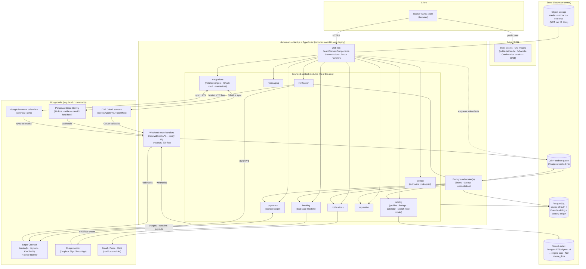

# 09 — System Architecture

> Part of the **showman** foundation doc set (`docs/foundation/`). This doc owns the **runtime shape** of the system: how the product is built and deployed, which **bounded contexts** the entities live in, how the `Event` log / webhook ingestion / background jobs physically work, and the **end-to-end security posture**. It is the bridge between the domain (`02`) and the eventual code (Phase 1+, see [`12-roadmap-risks-open-questions.md`](./12-roadmap-risks-open-questions.md)).
>
> **It does not redefine entities or invent behavior.** Entity shapes and the bounded-context names are fixed in [`02-domain-model.md`](./02-domain-model.md). The *behavior* this architecture hosts is owned by the deep-dive docs: verification (`03`), money (`04`), the deal state machine (`05`), calendar (`06`), authority/RBAC (`07`), and the read/search surface (`08`). This doc says **where that behavior runs, how the modules are bounded, and how it is secured** — and nothing the siblings already own.
>
> **What this doc owns (its mandate from the blueprint):**
> - The **modular monolith** decision and the module boundaries — each named module reconciled to the subsystem doc that owns its rules.
> - The **component / deployment map** (Next.js app + Postgres + Stripe + e-sign + DSP OAuth + job runner + object storage).
> - A **data-model overview** at the persistence layer (source of truth, the `Event`/audit log, the search index, the ledger-vs-Stripe split).
> - **Webhook ingestion** (Stripe, e-sign, DSP OAuth) and **background jobs** (escrow-release timers, hold expiry, notifications) as first-class infrastructure.
> - The **end-to-end security posture**: authz on the on-behalf-of model, secrets, PII handling for verification documents, least-privilege, idempotent payment webhooks.
>
> **Invariants this doc is on the hook to make *physically enforceable*:** **I-2** (every transition is an `Event` — the audit log is infrastructure, not a feature), **I-15** (showman never custodies funds — the ledger mirrors Stripe, never replaces it). It also implements the persistence-layer guards the siblings delegated here: the **`(artist, window, status=booked)` uniqueness constraint** (I-9, from [`06`](./06-availability-confirmation.md) §6), **idempotent payment webhooks** (from [`04`](./04-payments-escrow-disputes.md) §8 and [`05`](./05-negotiation-deal-lifecycle.md) §10), the **single `authorize()` chokepoint** over the `Membership` graph (I-4, from [`07`](./07-roster-org-rbac.md) §3.3), and **the floor is not in the search index** (I-6, from [`08`](./08-profiles-pitches-discovery.md) §4.3).

---

## 0. The thesis: a modular monolith with extract-ready seams

`init-jot` asks for a system that is *"modular and structurally sound and organized, that it is able to be understood as it scales and that it is able to scale."* The naive readings of that ask both fail:

- **Big-ball-of-mud monolith** — ships fast, becomes unmaintainable, can't be reasoned about. Fails "understandable as it scales."
- **Microservices from day one** — a solo founder distributing nine services across a network, reinventing transactions as sagas, and debugging eventual consistency before there is a single paying customer. Fails "able to be understood" *now*, and the escrow ledger (`04`) plus the deal state machine (`05`) demand strong transactional consistency that a premature service split actively fights.

> **Decision: a modular monolith — one deployable Next.js + TypeScript application, internally partitioned into the nine bounded contexts from [`02`](./02-domain-model.md), with boundaries enforced in code (not just convention) so any context can later be extracted into its own service without a rewrite.** One Postgres database, one deploy, in-process calls across module boundaries through explicit interfaces. We buy the regulated/commodity rails (Stripe Connect, Stripe Identity/Persona, e-sign) as external services and own the orchestration in the monolith — exactly the hybrid build-vs-buy from `01`.

This is the [`01`](./01-vision-strategy.md) "Umbrex" instinct made architectural: **design trust & safety and clean boundaries up front, but do not over-distribute early.** The seams are real; the network hops are not — yet.

### Why a monolith is *correct here*, not just expedient

1. **The transaction core needs ACID.** Confirming a deal must, in one transaction (`06` §6): promote the winning `Hold`, flip the `AvailabilityWindow` to `booked` (under a unique constraint), release sibling holds, void their Stripe authorizations, mint the `Confirmation`, and emit the `deal.confirmed` `Event`. The escrow ledger (`04`) must move `EscrowBalance` states and write `Event`s atomically with the policy decision. Spreading these across services turns one `BEGIN…COMMIT` into a distributed saga with compensating actions and partial-failure windows — a strictly worse way to protect money. A single Postgres transaction is the right tool.
2. **One ubiquitous language, one schema.** `02` mandates zero term drift between docs and code. A monolith with one schema makes that a compiler-checked property; a fleet of services with private schemas invites the exact drift `02` forbids.
3. **Solo-founder operability.** One thing to deploy, observe, roll back, and reason about. The blueprint's audience is one senior engineer; the architecture must be operable by one person.
4. **Extraction is cheap *if* the seams are honored.** The contexts that will actually want their own scaling/lifecycle later — `notifications`, `integrations`, the search read-model in `catalog`, and the webhook ingesters — are precisely the ones designed below as already-async, event-driven, and side-effect-only. They lift out first because they were built at arm's length from the transactional core.

### The boundary-enforcement rule (what makes it *modular*, not just one big folder)

> **Modules communicate only through their published interface (a service/port object), never by reaching into another module's tables or internals.** No cross-module SQL joins across context boundaries; no importing another module's repository. Cross-context reads go through the owning module's API; cross-context reactions go through the `Event` bus (§4). This is enforced with module-boundary lint rules (e.g. an import-boundaries / dependency-cruiser ruleset) in CI, so a boundary violation fails the build. The day we extract `notifications` into its own process, its callers already only knew its interface.

---

## 1. The bounded contexts (modules) — reconciled to their owning docs

The nine modules **are** the nine bounded contexts from [`02`](./02-domain-model.md) §1. Each module owns a slice of the schema (its tables), exposes a typed service interface, and emits/consumes `Event`s. The table below is the **reconciliation contract** the blueprint requires: every module named, the entities it owns ([`02`](./02-domain-model.md)), and the sibling doc that owns its *rules* (the module is the runtime host; the doc is the law).

| Module (bounded context) | Owns these `02` entities | Core responsibility (the runtime) | Rules owned by |
| --- | --- | --- | --- |
| **`identity`** | `User`, `Org`, `Membership` | AuthN (login/session); the single **`authorize()`** chokepoint over the `Membership` graph; org/roster/ownership lifecycle; the `staff` override surface. | [`07-roster-org-rbac.md`](./07-roster-org-rbac.md) (RBAC matrix, ownership, guardrails); [`03`](./03-trust-verification.md) for KYC sequencing |
| **`verification`** | verification state on `User`/`Org`/`ArtistProfile`/`Membership`; provenance records | Runs the three trust problems: identity (KYC), authority (DSP claim / vouch / documentary), KYB; mints/decays **provenance badges**; T&S queues. | [`03-trust-verification.md`](./03-trust-verification.md) |
| **`catalog`** | `ArtistProfile`, `BookerProfile`, `Listing`, `AvailabilityWindow`, `Hold`, EPK presentation entities (`ProfileMedia`, `BookingCredit`), the **search index** | Profiles/EPK/dossier; listings (incl. the never-exposed `private_floor`); the calendar substrate + `Hold` soft-lock; discovery/search/ranking read-model. | [`08-profiles-pitches-discovery.md`](./08-profiles-pitches-discovery.md) (profiles/pitch/discovery); [`06`](./06-availability-confirmation.md) (calendar/`Hold`) |
| **`booking`** *(a.k.a. the deal context)* | `BookingRequest` (+ embedded `Pitch`), `Offer`/`CounterOffer`, `Agreement`/`Contract`, `BookingGroup` | Hosts the **deal state machine** — every transition, every guard, the floor check, the `Confirmation`-trigger; team routing/dedup (I-12). The orchestration heart. | [`05-negotiation-deal-lifecycle.md`](./05-negotiation-deal-lifecycle.md); confirm artifact in [`06`](./06-availability-confirmation.md); team routing in [`07`](./07-roster-org-rbac.md) |
| **`payments`** | `Deposit`, `EscrowBalance`, `Payment`, `Payout`, `Dispute` | The **escrow ledger** (policy source of truth) mirrored against Stripe (cash source of truth); deposit/balance capture, release timers, refunds, the dispute adjudication flow; the take-rate carve. | [`04-payments-escrow-disputes.md`](./04-payments-escrow-disputes.md) |
| **`messaging`** | the in-thread message surface inside a `BookingRequest` | The **typed, no-open-inbox** contact surface that lives inside a deal thread (there is no generic DM — `03` §3.1). Pitch + offer commentary; report-in-thread hooks. | [`03`](./03-trust-verification.md) §3 (verified-only, money-gated, typed); thread lives on [`05`](./05-negotiation-deal-lifecycle.md)'s request |
| **`notifications`** | `Notification` | Consumes `Event`s; resolves recipients via the **`Membership` fan-out** (I-21); renders + delivers across `in_app`/`email`/`push` and `notification_sink` integrations; the never-suppressed confirmation alert. | [`06`](./06-availability-confirmation.md) §5 (confirmation comms); fan-out rule from [`07`](./07-roster-org-rbac.md) §8 |
| **`reputation`** | `Review`, `ReputationScore` | Recomputes the per-principal derived score from `Agreement` outcomes + `Dispute` history + `Review`s (no deal, no review — I-20); two-sided blind-release reviews; projects `ReputationSummary`. | [`08`](./08-profiles-pitches-discovery.md) §5–6; dispute-rate input from [`04`](./04-payments-escrow-disputes.md) |
| **`integrations`** | `Integration` (verification_source / calendar_sync / notification_sink) | **Webhook ingestion** (Stripe, e-sign, DSP OAuth) and outbound connectors (email, Slack, ICS/calendar); the OAuth/token vault; the anti-corruption layer that turns vendor payloads into internal `Event`s. | [`03`](./03-trust-verification.md) (verification sources), [`04`](./04-payments-escrow-disputes.md) (Stripe webhooks), [`06`](./06-availability-confirmation.md) (calendar sync/ICS) |

> **Naming note for code.** `02`'s glossary is canonical: the supply/discovery context is **`catalog`** (it also hosts the calendar substrate `06` owns), and the deal context is **`booking`**. The blueprint's shorthand "catalog/listings" and "booking/deal" map onto `catalog` and `booking` respectively. The `messaging` module is intentionally thin — per [`03`](./03-trust-verification.md) §3.1 *there is no open messaging surface*; "messaging" is the in-thread, typed contact that rides on a `BookingRequest`, not a chat product.

### Dependency direction (who may call whom)

Modules form a layered dependency graph. **`identity` is the floor** — everything depends on `authorize()`; it depends on nothing else. **The `Event` bus is the ceiling** — side-effecting modules (`notifications`, `reputation`, parts of `integrations`, the `catalog` search read-model) *react* to events rather than being called synchronously, which is what keeps them extract-ready.

```
                         ┌──────────────────────────────────────────┐
   reacts to Events  ◄───┤ notifications · reputation · search-index │  (async, side-effect-only)
   (no sync callers       └──────────────────────────────────────────┘
    of the core)                         ▲  Events (I-2)
                                         │
        ┌────────────────────────────────┴────────────────────────────────┐
        │   booking (deal state machine)  ── orchestrates ──►  payments    │  (transactional core)
        │        │                                  │            (escrow)    │
        │        ├── reads catalog (listing/hold/availability)              │
        │        └── reads verification (badge/authority gate)             │
        └────────────────────────────────┬────────────────────────────────┘
                                         │ every action first calls
                                         ▼
                              ┌────────────────────────┐
                              │  identity.authorize()  │  (the one gate; I-4)
                              └────────────────────────┘
                                         ▲
                              integrations  ── ingests vendor webhooks, emits Events ──►
```

- **`booking` is the orchestrator** of the transactional core: it reads from `catalog` (the `Listing` + its hidden `private_floor`, the `AvailabilityWindow`/`Hold`) and `verification` (authority/badge state), and it drives `payments` (capture/release) — all behind interfaces, much of it inside one DB transaction.
- **No cycles.** `notifications`/`reputation`/`search-index` never call back *into* the core synchronously; they subscribe to `Event`s. This is the rule that makes them the first clean extractions.
- **`integrations` is upstream of everything via events**: a Stripe `payment_intent.succeeded` webhook enters through `integrations`, is normalized, and becomes a `system`-actor `Event` that drives a `booking`/`payments` transition (`05` §9).

---

## 2. Component & deployment map

One application, a managed Postgres, a job runner, object storage, and a small set of bought vendor rails. Nothing exotic — deliberately boring infrastructure a solo founder can run.



### 2.1 The tiers, concretely

| Tier | What it is | Notes |
| --- | --- | --- |
| **Web tier** | Next.js App Router — **React Server Components** for reads, **Server Actions** + **Route Handlers** for writes/APIs. | Server Actions are the natural home for "an authorized actor triggers a transition" — they run server-side, call `authorize()`, then the module service. The browser never talks to Stripe/e-sign/DSP directly for privileged ops. |
| **Module layer** | The nine context modules as in-process TypeScript packages with typed service interfaces. | This is where all domain logic lives. Web tier is thin; modules are the product. |
| **Webhook handlers** | Dedicated `/api/webhooks/*` route handlers, one per vendor. | **Verify signature → persist raw event → enqueue → return 200 fast.** They do *no* business logic inline (§5). |
| **Background worker** | A job/worker process (can be the same deploy with a worker entrypoint, or a separate one) draining the queue: timers, fan-out, reconciliation, webhook processing. | v1: a Postgres-backed queue + worker (e.g. a transactional job library). Extractable to a dedicated queue (SQS/Redis) later without touching callers (§6). |
| **Postgres** | The single source of truth: domain tables, the `Event`/audit log, the escrow ledger, the transactional outbox. | One primary; read replicas are a later scaling lever, not a v1 need. |
| **Object storage** | Media (`ProfileMedia`), generated contract PDFs, dispute evidence attachments, pitch attachments. | **Never raw government-ID images** — those stay at Persona/Stripe (§7.3). |
| **Search index** | v1 Postgres FTS + `pg_trgm`; a dedicated engine (Meilisearch/Typesense/OpenSearch) is a later swap. | The `private_floor` is **never** a field in the index (I-6 / [`08`](./08-profiles-pitches-discovery.md) §4.3). |
| **CDN/edge** | Static assets, OG images, and the public `/a/<handle>`, `/b/<handle>`, and **Confirmation** cards ([`06`](./06-availability-confirmation.md) §4.4, [`08`](./08-profiles-pitches-discovery.md)). | The public promo card is a cacheable, OG-optimized page — the growth-loop surface. |

### 2.2 ORM choice: Prisma or Drizzle (a deferred, low-stakes call)

The blueprint leaves "Prisma or Drizzle" open; both are fine. The decision criteria for this system specifically:

- **The escrow ledger and the deal state machine want explicit transactions and raw-SQL escape hatches** (the `(artist, window, status=booked)` partial unique index, `SELECT … FOR UPDATE` on a `Hold`, advisory locks for confirm). **Drizzle** is closer to SQL and makes those ergonomic; **Prisma** is more batteries-included but historically more opinionated about raw transactions/partial indexes.
- **Recommendation (non-binding, decided in Phase 1):** lean **Drizzle** for the transactional precision the money layer needs, *or* Prisma if migration velocity matters more early — but **the architecture does not depend on which.** Module boundaries hide the ORM; a module's interface returns domain types, never ORM rows. Carried in [`12`](./12-roadmap-risks-open-questions.md).

---

## 3. Data-model overview (the persistence layer)

This is the architecture *of the data*, not a re-listing of `02`'s entities. Four persistence facts define the system.

### 3.1 Postgres is the single source of truth; one schema, module-owned tables

All nine modules persist to **one Postgres database**. Each module **owns its tables** and is the only writer to them; cross-module reads go through the owning module's service interface, not foreign SQL. Foreign keys *within* a module are normal; references *across* modules are by id with the relationship mediated in code (so the boundary survives a future extraction). This gives us ACID where the core needs it (§0) while keeping the modular discipline that lets a context lift out.

### 3.2 The `Event` log is the spine of the runtime (I-2)

[`02`](./02-domain-model.md) §1.6 and [`05`](./05-negotiation-deal-lifecycle.md) §9 make the audit log a *requirement*, not a feature. Architecturally, the `Event` table is an **append-only, immutable log** and the single seam four subsystems read from:

```
event
──────────────────────────────────────────────────────────────
  id              uuid        pk
  correlation_id  uuid        -- the BookingRequest/Agreement thread (05 §9)
  actor           ref         -- User id, or the literal `system`
  principal       ref         -- ArtistProfile | BookerProfile | Org (whose name it binds)
  role            enum?       -- the Membership role exercised (owner|agent|finance|viewer)
  action          string      -- "offer.countered", "deal.confirmed", "deposit.captured" …
  before_status   string?     -- the edge traversed (05 transition table)
  after_status    string?
  payload         jsonb       -- offer amount, envelope id, payment id, vendor event id …
  occurred_at     timestamptz default now()
  INDEX (correlation_id, occurred_at)
  INDEX (principal, occurred_at)
  -- append-only: no UPDATE/DELETE grants on this table (§7.5)
```

Its four consumers (built once, reused everywhere — `05` §9):

1. **`notifications`** — every `Event` is a candidate notification; recipients resolved by `Membership` fan-out (I-21).
2. **`integrations`** — email/Slack/ICS sinks and any external coordination subscribe to the same stream.
3. **`payments`/`booking` dispute evidence** — the immutable `(actor, principal, role, before→after)` history is the factual backbone for adjudication (`04` §6).
4. **Authority audit** — every on-behalf-of action is provable after the fact (I-2, `07` §0).

> **Event sourcing vs. event log — a deliberate boundary.** We do **not** event-source the domain (state is the source of truth in the module tables; the `Event` log is the audit/integration record *of* transitions). This keeps the transactional core simple and queryable while still giving us the immutable history `init-jot` and the dispute flow demand. The state machine in `05` lives as explicit status columns + guards, with each committed transition writing exactly one `Event` in the same transaction. **A status change without an `Event` is a bug** (`05` §9).

### 3.3 The escrow ledger mirrors Stripe — it never replaces it (I-15)

Per [`04`](./04-payments-escrow-disputes.md) §3.1/§8, **Stripe is the cash source of truth; the showman ledger is the policy source of truth.** Architecturally:

- The `payments` module persists `EscrowBalance`/`Payment`/`Payout`/`Deposit`/`Dispute` rows that *mirror* Stripe state. Decisions ("is this deal funded? released? frozen?") read **our ledger**, never a live Stripe API read at decision time.
- Ledger state advances on **Stripe webhooks** (§5), each recorded as a `system`-actor `Event`. A periodic **reconciliation job** (§6) diffs the ledger against Stripe and flags divergence to ops — the two are never allowed to silently drift.
- **showman holds no balance of its own representing deal funds** (I-15). The ledger is bookkeeping over Stripe-custodied money, not a wallet.

### 3.4 The search index is a derived read-model, and the floor is not in it (I-6)

The `catalog` discovery surface (`08`) is a **read-model projected from** `ArtistProfile`/`Listing`/`AvailabilityWindow`/verification/reputation state, rebuilt reactively from `Event`s. Two hard architectural constraints:

- **`Listing.private_floor` is never a column, facet, filter input, or sort key in the index** (I-6, `08` §4.3). It is physically absent from the projection. You cannot binary-search a value that the index does not contain.
- **`legal_name`, raw `AvailabilityWindow` internals, payment-method details, and `User` actor identities are likewise excluded** (`08` §4.3). The projection carries only the public/vouched-for facets.

v1 indexes in Postgres (FTS + trigram); the projection is the same regardless of engine, so swapping to Meilisearch/Typesense later is a connector change, not a model change.

### 3.5 The transactional outbox (how a DB commit reliably becomes an `Event`/side-effect)

The hardest correctness problem in an event-driven system is *"the transaction committed but the notification/webhook-reaction was lost"* (or fired twice). We solve it with the **transactional outbox** pattern and **not** with dual-writes:

- Inside the same transaction that mutates domain state and appends the `Event`, we insert an **outbox row** (the intended side-effect: notify, sync, enqueue a fan-out).
- A relay (the background worker, §6) reads committed outbox rows and dispatches them **at-least-once**, marking them done.
- Every consumer is **idempotent** (keyed on `Event` id / outbox id), so at-least-once delivery is safe (§5, §6). This is the same idempotency discipline the payment webhooks require, applied uniformly.

This is what lets `notifications`/`reputation`/`search-index` be reaction-only and still never miss (or double-apply) an event — the property that makes them extract-ready.

---

## 4. The `Event` bus / how modules react without coupling

Modules **act** through interfaces (synchronous, in-process, transactional where needed) and **react** through `Event`s (asynchronous, via the outbox/queue). The split is the whole modularity story:

| Interaction | Mechanism | Example |
| --- | --- | --- |
| **Core orchestration** (must be consistent) | Direct interface call, often in one DB transaction | `booking` confirming a deal calls `catalog` to promote the `Hold` and `payments` is already funded — atomic (§0, `06` §6). |
| **Cross-context reaction** (eventually consistent is fine) | `Event` → outbox → queue → subscriber | `deal.confirmed` → `notifications` fans out to both teams; `integrations` emits ICS; `catalog` updates the search read-model. |
| **Inbound from vendors** | Webhook → normalize → `system` `Event` → drives a transition | Stripe `payment_intent.succeeded` → `deposit.captured` `Event` → `booking` advances `ContractSigned → DepositCaptured` (`05` T17). |

In-process today, the bus is a typed dispatcher over the outbox. Because subscribers only know the `Event` contract, the day `notifications` becomes its own service the bus becomes a real broker (the queue) and nothing in the publishers changes. This is the literal mechanism by which "boundaries clean enough to extract into services later" is true rather than aspirational.

---

## 5. Webhook ingestion (Stripe, e-sign, DSP OAuth) — the correctness-critical edge

External truth arrives as webhooks. Three sources, one disciplined pipeline, owned by `integrations` and consumed by the relevant core module. The siblings that *depend* on this pipeline: payments capture/release ([`04`](./04-payments-escrow-disputes.md) §8), contract execution ([`05`](./05-negotiation-deal-lifecycle.md) T14), DSP claim verification ([`03`](./03-trust-verification.md) §1.1), calendar sync ([`06`](./06-availability-confirmation.md) §1.4).

### 5.1 The ingestion pipeline (identical shape for every vendor)

```
  vendor ──HTTP POST──►  /api/webhooks/{vendor}
                              │
                 1. VERIFY SIGNATURE  (Stripe-Signature / e-sign HMAC / OAuth state+PKCE)
                              │   reject (400) if invalid — never trust an unsigned payload
                              ▼
                 2. PERSIST RAW EVENT  (webhook_event row: vendor, vendor_event_id, raw jsonb)
                              │   UNIQUE(vendor, vendor_event_id)  ← the idempotency anchor
                              ▼
                 3. ENQUEUE + RETURN 200 FAST  (do NO business logic inline)
                              │
                              ▼  (background worker, §6)
                 4. PROCESS IDEMPOTENTLY  →  normalize to a system-actor Event
                              │             →  drive the core transition (05/04/03/06)
                              ▼
                 5. ACK / mark webhook_event handled  (retry with backoff on failure)
```

### 5.2 Idempotent payment webhooks (the blueprint's explicit security requirement)

Money correctness is *mostly* "don't double-act and don't drift" ([`04`](./04-payments-escrow-disputes.md) §8). The mechanisms, made concrete here:

- **Inbound idempotency.** `UNIQUE(vendor, vendor_event_id)` on the raw `webhook_event` row makes a re-delivered Stripe event a no-op at ingestion — the second insert conflicts and the duplicate is dropped. Stripe *will* redeliver; this is the wall.
- **Outbound idempotency.** Every charge/transfer/refund to Stripe carries a **Stripe idempotency key derived from `Agreement` + purpose** (e.g. `agreement:{id}:capture:balance`, `agreement:{id}:transfer:release`) — a retried timer or a double-submit cannot double-charge or double-release (`04` §8).
- **Processing idempotency.** Handlers are idempotent on the normalized `Event` (and check current ledger state before acting): a `payment_intent.succeeded` re-processed when the `EscrowBalance` is already `fully_funded` is a no-op, not a second capture.
- **State re-check at fire time.** The release timer (§6) re-reads ledger state when it fires — *still `release_pending`? no open `Dispute`?* — so a dispute that landed one minute before the timer wins (`04` §8, INV-2). The timer never acts on stale state.

### 5.3 Per-vendor specifics

| Vendor / source | Auth on inbound | Drives | Owning consumer |
| --- | --- | --- | --- |
| **Stripe Connect / Identity** | `Stripe-Signature` (HMAC, replay-protected) | `deposit.captured`, balance capture, `transfer`/`payout`, `charge.refunded`, `charge.dispute.created` (card chargeback ≠ our `Dispute`, `04` §9), KYC/KYB status | `payments` (money), `verification` (KYC/KYB) |
| **E-sign (Dropbox Sign / DocuSign)** | vendor HMAC on the event payload | envelope `fully_executed` → `contract.executed` (`05` T14); signer events | `booking` |
| **DSP OAuth (Spotify/Apple/YouTube/Meta)** | OAuth 2.0 **authorization-code + PKCE**; `state` (CSRF) verified | claim/authority confirmation (`03` §1.1); periodic re-check for **badge decay** (`03` §4) | `verification` |
| **Calendar sync (Google/external)** | OAuth + provider push/webhook | inbound `blocked` `AvailabilityWindow`s (`06` §1.4); conflict → team alert, never silent hold release | `catalog` |

> **DSP API reality is an open risk, not a settled fact.** [`03`](./03-trust-verification.md) §7 flags that some of Spotify-for-Artists / Apple / YouTube / Meta may not expose a usable third-party OAuth/claim API without a partnership. The `integrations` module is built so each verification source is a **pluggable connector behind a common interface**; if a DSP requires a scrape-and-screenshot or partnership fallback, only that connector changes — the `verification` rules (`03`) and the badge model are unaffected. Spike each API before committing (carried in [`12`](./12-roadmap-risks-open-questions.md)).

---

## 6. Background jobs (escrow-release timers, hold expiry, notifications, reconciliation)

Much of the platform is driven by **time and silence**, not clicks (`05` §10: "timers are first-class transitions"). The job runner is therefore core infrastructure, not a cron afterthought.

### 6.1 The job catalog

| Job | Fires on | What it does | Owner doc |
| --- | --- | --- | --- |
| **Escrow auto-release** | `EscrowBalance.release_eligible_at` (show_end + settlement window) | Re-check (still `release_pending`, no open `Dispute`) → `Transfer` + `Payout` (− take rate) → `released`; `Performed → Settled` (`05` T23). | [`04`](./04-payments-escrow-disputes.md) §8, [`05`](./05-negotiation-deal-lifecycle.md) |
| **Hold expiry** | `Hold.expires_at` (or challenge/confirmation deadlines) | Transition hold → `expired`, recompute window status, **void the Stripe deposit authorization**, emit release `Event` (`06` §2.4, I-11). Event-driven, never lazy "check on read" — a dangling auth must be actively released. | [`06`](./06-availability-confirmation.md) |
| **Balance-due reminder / cutoff** | lead time before performance date | Remind/escalate balance capture; enforce the **balance-before-performance** funding cutoff (I-16) — funding failure cancels vs. booker, blocks `Performed` (`04` §6, `05` T21). | [`04`](./04-payments-escrow-disputes.md) / [`06`](./06-availability-confirmation.md) |
| **Deal/offer/signature expiry** | request send-expiry, open `Offer` expiry, signature-window | Fire `system` `Expired` edges (`05` T5/T10/T15). The platform's default answer to silence. | [`05`](./05-negotiation-deal-lifecycle.md) |
| **Notification fan-out** | any `Event` (via outbox) | Resolve `Membership` recipients (I-21), render per channel/preference, deliver; confirmation alert is never-suppressed (`06` §5). | [`06`](./06-availability-confirmation.md) / [`07`](./07-roster-org-rbac.md) |
| **Badge decay / re-verification** | periodic + on high-value transaction | Re-check `verification_source` OAuth; demote stale badges (`VERIFIED → UNVERIFIED`, `03` §1.6/§4). | [`03`](./03-trust-verification.md) |
| **Reputation recompute** | on `Agreement` outcome / `Dispute` resolve / `Review` release | Recompute `ReputationScore`, refresh `ReputationSummary` projection (I-20). | [`08`](./08-profiles-pitches-discovery.md) |
| **Stripe reconciliation** | periodic | Diff ledger vs. Stripe balances/transfers; flag divergence to ops (`04` §8). | [`04`](./04-payments-escrow-disputes.md) |
| **Search read-model rebuild** | on relevant `Event`s | Update the discovery projection (floor still excluded, I-6). | [`08`](./08-profiles-pitches-discovery.md) |

### 6.2 Job-runner properties (the rules every job obeys)

- **Idempotent + state-rechecking.** Every job re-reads current state before acting and is safe to run twice (a redelivered job, an overlapping schedule). The release timer's pre-flight re-check is the canonical example (`04` §8). At-least-once execution is the contract; idempotency makes it safe.
- **A timer is a transition, and a transition emits an `Event` (I-2).** A `system`-actor `Event` is written for every timer-driven edge, identical in shape to a human-driven one — the audit log doesn't distinguish "the manager confirmed" from "the release timer fired" in *form*, only in `actor`.
- **One scheduling source of truth.** v1: a Postgres-backed job/queue (transactional with domain writes via the outbox, so "schedule a release at T" commits atomically with the state change that warranted it). Extractable to a dedicated queue/scheduler later — callers schedule against an interface, not the queue impl.
- **Concurrency guards live at the DB.** The confirm race and the one-open-`Offer` rule (`05` §10, `06` §6) are enforced with row locks / partial unique constraints inside the transaction, not with application-level "check then act." Jobs that touch a deal take the same locks as a user action would.

---

## 7. End-to-end security posture

Security here is not a checklist bolted on — it is the same trust spine (`03`) and authority model (`07`) made physical. Five fronts: **authorization on the on-behalf-of model, secrets, PII for verification documents, least-privilege, and idempotent payment webhooks.** (The fifth is in §5.2; the rest follow.)

### 7.1 Authorization is the on-behalf-of model, enforced at one chokepoint (I-4)

The entire authority model from [`07`](./07-roster-org-rbac.md) reduces to one server-side predicate, and **every privileged action routes through it** — there is no second path:

```
identity.authorize(actor: User, action: Action, target: Principal) -> Allow | Deny
   1. resolve an *active* Membership whose principal *covers* target   (07 §3.3.1)
        — walks the ownership/roster edge (Org → ArtistProfile / BookerProfile)
        — none ⇒ Deny  (I-4: no authority, no action)
   2. check PERMISSION_MATRIX[role][action]  (07 §3.2), incl. ⚠️ conditions
   3. Allow ⇒ emit Event(actor, target, role, action)  (I-2); else Deny
```

Architectural commitments that make this trustworthy:

- **Authority is evaluated live, never baked into a session/JWT claim.** A `revoke`/`suspend` takes effect on the *next* check, mid-deal if need be (`07` §2, I-4). The session proves *who the actor is* (authentication); it never carries *what they may do* (authorization) — that is recomputed against the `Membership` graph every time.
- **The `User` is never a counterparty** (I-1). Server Actions resolve `(actor, principal)` and write both to the `Event`; principals are the parties on every `BookingRequest`/`Offer`/`Agreement`/`Payment`.
- **`identity` is the only module that owns `authorize()`.** Other modules call it; none reimplement it. A boundary-lint rule forbids ad-hoc permission checks outside `identity`.
- **`staff` override is itself audited** as `(actor=staff, …)` and never silent (`07` §3.3) — the trust & safety surface is a privileged caller of the same gate, not a backdoor around it.
- **Step-up / cool-down / two-person / funded-deal-lock guardrails** (`07` §5) layer *on top* of `authorize()` for high-blast-radius actions (change payout bank account, transfer/delete org, large manual payout). Architecturally these are additional gates the action must clear *after* `authorize()` allows — re-authentication challenges, time-delays enforced by a job, and a DB lock that blocks org deletion while a funded `EscrowBalance` exists.

### 7.2 Secrets management

- **No secrets in source, ever.** Stripe keys, e-sign keys, DSP OAuth client secrets, webhook signing secrets, the DB URL, and the token-vault encryption key live in a **secrets manager** (platform-provided / Vault / cloud KMS-backed), injected as runtime env — never committed, never in client bundles.
- **Server-only by construction.** All privileged vendor calls happen in Server Actions / Route Handlers / the worker. Next.js public env (`NEXT_PUBLIC_*`) carries only the publishable Stripe key and non-secret config; the boundary is enforced by the framework and checked in review.
- **Rotation-ready.** Webhook signing secrets and API keys are rotatable without a deploy where the vendor supports dual-secret windows; the verification step (§5.1) accepts the current and previous signing secret during a rotation window.
- **Least-privilege keys.** Use restricted/scoped Stripe keys for the operations that need them; the worker and web tier get only the scopes they use.

### 7.3 PII handling for verification documents (the highest-sensitivity data) ⚖️

This is the front [`03`](./03-trust-verification.md) §1.3 (T12) and the blueprint single out. The governing principle: **don't custody what we can offload.**

- **Raw government-ID images and selfies never touch showman storage.** Stripe Identity / Persona host the **hosted** KYC flow; the applicant uploads to *them*; they return a **pass/fail + minimal attributes + a verification id**. showman persists the *result and provenance*, not the raw document (`03` §1.3, T12). Our object storage holds media/contracts/evidence — **not** ID docs.
- **Data minimization.** We store the least that satisfies the authority/identity model: "KYC passed via {vendor} at {time}, verification id {x}," "KYB verified, beneficial-owners cleared at {vendor}." Not the passport scan, not the biometric template.
- **Encryption.** TLS in transit everywhere; encryption at rest for the DB and object storage; the OAuth/token vault (§7.4) encrypts tokens with a KMS-managed key (envelope encryption), distinct from the app DB credentials.
- **Retention & deletion ⚖️ LEGAL FLAG.** Retention windows, BIPA-style biometric consent, and deletion/erasure flows are regulated and **need counsel** — carried in [`03`](./03-trust-verification.md) §7 and [`12`](./12-roadmap-risks-open-questions.md). Architecturally we keep PII isolated and offloaded *specifically so* the retention surface we must reason about is as small as possible.
- **Access to any PII-adjacent attribute is logged** as an `Event` and gated by `staff` authority — even reading a verification result is an audited, authorized action.

### 7.4 The OAuth / token vault (`integrations`)

`Integration` rows reference **credentials/token refs, not raw tokens in plaintext columns** (`02` §1.6 explicitly defers secrets handling to this doc). The `integrations` module owns a **token vault**:

- DSP OAuth tokens, calendar-sync tokens, and Slack tokens are stored **encrypted at rest** (KMS-backed envelope encryption), decrypted only in-process at call time.
- Tokens are **scoped to the owning principal** and used only by the connector that owns them; a leak of one principal's token cannot be replayed for another (the connector resolves the principal and re-checks authority).
- **Revocation/decay is first-class:** when a DSP grant is revoked upstream, the re-check job (§6) catches it and decays the badge (`03` §4) — the vault is not a place tokens go to rot.

### 7.5 Least-privilege, defense-in-depth, and the audit guarantee

- **Per-module DB privileges (target posture).** A module's data access is scoped to its own tables; the `Event` table is **append-only at the privilege level** (no `UPDATE`/`DELETE` grant) so the audit log is tamper-evident by construction (§3.2). Even if application code is wrong, the database refuses to mutate history.
- **Tenant isolation by `Membership`, enforced in queries.** Every data-access path filters by the authorized principal resolved in `authorize()`; there is no "list all deals" query that isn't scoped to a principal the actor covers. This is how the on-behalf-of model becomes data-access reality, not just a UI affordance.
- **Input/abuse hardening.** Rate limits and graduated-trust throttles (`03` §3.2) are enforced server-side at the action boundary (card-testing caps, request caps, verification-attempt caps, floor-probe rate limiting from `05` §10). Standard web hygiene (CSRF protection on Server Actions, output encoding, parameterized queries via the ORM, security headers/CSP at the edge) is assumed and not enumerated further.
- **Money endpoints are doubly guarded:** `authorize()` (role) + step-up/cool-down (`07` §5) + Stripe-side KYB gating (no payout to an unverified account, `03`/`04`) + idempotency (§5.2). Four independent gates protect every fund movement.
- **The audit log is the security backstop.** Because every authorized action and every transition emits an immutable `Event` (I-2), post-incident forensics ("who did what, on whose behalf, under which role, when") is always answerable — the same property the dispute flow (`04`) relies on.

### 7.6 Authentication & session hardening (self-hosted email/password + sessions)

Authentication (**who you are**) is distinct from authorization (**what you may do**, §7.1). This section governs the authN layer: how credentials are stored, how a login becomes a session, and the production posture that layer must reach before launch. The stack is a self-hosted email/password + server-side session model (Better Auth), with the `user` / `account` / `session` / `verification` tables owned by the `identity` context; OAuth providers attach as additional `account` rows without changing this posture.

- **Passwords are hashed, never stored or encrypted.** Credentials live only as a **salted, slow (bcrypt/scrypt/argon2) hash** in `account.password`. Hashing is one-way: a database leak yields hashes, not passwords, and salting + slow-hashing make offline cracking impractical. showman never implements its own hashing — this is delegated to the auth library. (Identity lives on `user`; credentials on `account`, so one principal can hold multiple sign-in methods.)
- **Sessions are server-side; the cookie is only a claim token.** The authoritative session is a `session` row (token, `expiresAt`, `userId`); the browser holds a cookie carrying the **token, not the session data**. This is what makes logins **revocable** — deleting the row kills the session immediately, independent of cookie expiry (enables sign-out and "sign out all devices").
- **Session cookies are hardened.** `HttpOnly` (unreadable by client JS, defeats XSS token theft), `Secure` (HTTPS-only), and `SameSite` (CSRF defense) are required in production. These complement the trusted-origin check below.
- **TLS everywhere for the app tier, not just the PII flows (§7.3).** Session cookies traverse the network on every request; without HTTPS end-to-end the claim token is sniffable and impersonation is trivial. HTTPS is a launch gate, not an enhancement.
- **The auth signing secret is a managed secret.** The session/cookie signing+encryption secret follows §7.2 (secrets manager, injected as runtime env, never committed). A leaked secret means forgeable sessions; it is rotatable on the same basis as other keys.
- **Trusted-origin / CSRF enforcement on auth POSTs.** Auth mutations require the request `Origin` to match the configured app origin(s), so the automatically-attached cookie cannot be weaponized by a third-party site. (This is also why non-browser callers — tests, future mobile — must send an explicit origin; mobile clients use token-based auth rather than browser cookies, see §2.)
- **Email verification is a trust floor.** The `verification` table + `emailVerified` flag gate money-adjacent and listing actions; requiring a verified email raises the spam floor cheaply and dovetails with the graduated-trust throttles in §7.5 and [`03`](./03-trust-verification.md) §3.2.
- **Auth endpoints are rate-limited** (sign-in guessing, sign-up spam) at the action boundary per §7.5 — the authN-side complement to the money-side caps.

**Pre-launch authN gate (none are code-optional):** HTTPS enforced · real signing secret from the secrets manager · hardened cookie flags · DB encryption at rest for `user`/`account`/`session` (§7.3) · auth-endpoint rate limits · email verification enforced on money-adjacent actions.

---

## 8. How the architecture honors the spine (traceability)

The blueprint requires this doc to reconcile with `02`–`08` and to make specific invariants *physically* hold. Explicit mapping:

| Invariant / sibling guarantee | Where this architecture enforces it |
| --- | --- |
| **I-2** — every transition is an `Event` | Append-only `Event` table (§3.2); outbox writes it in the same transaction as the state change; DB-level append-only privilege (§7.5); timers emit `system` `Event`s (§6.2). |
| **I-4** — authority gates every OBO action | The single `identity.authorize()` chokepoint, evaluated live, never cached in the session (§7.1). |
| **I-6** — the floor is invisible | `private_floor` is physically absent from the search index/read-model and never an API output (§3.4). |
| **I-9** — no double-booking | DB **partial unique constraint** on `(artist, window, status=booked)` enforced inside the confirm transaction (§0, §6.2; from [`06`](./06-availability-confirmation.md) §6). |
| **I-15** — showman never custodies funds | The escrow **ledger mirrors Stripe**; decisions read the ledger; reconciliation guards drift; no showman wallet (§3.3). |
| **I-16 / I-17** — balance-before-show / auto-release | Balance-due cutoff job + release timer with fire-time re-check (§6.1, §5.2). |
| **I-21** — notifications fan out to the team | `notifications` resolves recipients via the `Membership` graph off the `Event` stream (§1, §6.1). |
| **Idempotent payment webhooks** (blueprint) | `UNIQUE(vendor, vendor_event_id)` + outbound Stripe idempotency keys + state-rechecking handlers (§5.2). |
| **PII offloaded for verification docs** (`03` T12) | Raw IDs/selfies stay at Stripe/Persona; showman stores result + provenance only (§7.3). |
| **`authorize()` single chokepoint** (`07` §3.3) | Owned solely by `identity`; lint-enforced; `staff` override audited through the same gate (§7.1). |

---

## 9. Open questions (carried, not blocking)

- **ORM: Prisma vs. Drizzle.** Leaning Drizzle for transactional/raw-SQL precision in the money + confirm paths; not architecturally load-bearing (§2.2). → [`12`](./12-roadmap-risks-open-questions.md).
- **Search engine timing.** v1 Postgres FTS/trigram; when does routing-aware + faceted ranking at scale justify Meilisearch/Typesense/OpenSearch? The floor stays out of the index regardless (§3.4, [`08`](./08-profiles-pitches-discovery.md) §10). → [`12`](./12-roadmap-risks-open-questions.md).
- **Queue/worker substrate.** Postgres-backed job+outbox for v1; promotion to a dedicated queue/scheduler (SQS/Redis/Temporal-style) is an extraction trigger tied to volume, not a launch need (§6.2).
- **First extraction candidates.** `notifications` and `integrations` (already async/side-effect-only) are the cleanest lift-outs; revisit when a single context's scaling or failure-isolation needs diverge from the core (§0, §1).
- **DSP verification-source API access.** Whether each of Spotify/Apple/YouTube/Meta exposes a usable third-party OAuth/claim API or forces a partnership/fallback — connector-isolated here, but spike before committing (§5.3; [`03`](./03-trust-verification.md) §7). → [`12`](./12-roadmap-risks-open-questions.md).
- **Deployment topology.** Single combined web+worker deploy vs. split worker process from day one; both supported by the design, decided on operational preference at Phase 1 (§2.1).
- **Multi-region / cross-border.** The beachhead is single-region/single-currency (`04` §9, `11`); the schema avoids single-currency assumptions but multi-region data residency (relevant to PII, §7.3) is a later, counsel-involved question. → [`12`](./12-roadmap-risks-open-questions.md).

---

### Cross-references

- **Entities, ubiquitous language, invariants, the bounded-context names** → [`02-domain-model.md`](./02-domain-model.md)
- **Verification behavior, KYC/KYB, DSP claim, badge decay, PII offload thesis** → [`03-trust-verification.md`](./03-trust-verification.md)
- **Escrow ledger, Stripe topology, idempotency, reconciliation, dispute flow** → [`04-payments-escrow-disputes.md`](./04-payments-escrow-disputes.md)
- **The deal state machine this hosts; timers/webhooks as transitions; the `Event` seam** → [`05-negotiation-deal-lifecycle.md`](./05-negotiation-deal-lifecycle.md)
- **Calendar substrate, `Hold`, the confirm transaction, the `(artist, window, booked)` constraint** → [`06-availability-confirmation.md`](./06-availability-confirmation.md)
- **The `authorize()` rule, RBAC matrix, ownership lifecycle, sensitive-action guardrails** → [`07-roster-org-rbac.md`](./07-roster-org-rbac.md)
- **The `catalog` read/search surface, ranking, "floor not in the index"** → [`08-profiles-pitches-discovery.md`](./08-profiles-pitches-discovery.md)
- **Design surfaces for these flows** → [`10-design-direction-ux.md`](./10-design-direction-ux.md)
- **T&S ops, queues/SLAs that run on these queues** → [`11-gtm-liquidity-trust-safety-ops.md`](./11-gtm-liquidity-trust-safety-ops.md)
- **Money-transmission counsel, PII retention/consent, DSP API reality, ORM/search/queue choices** → [`12-roadmap-risks-open-questions.md`](./12-roadmap-risks-open-questions.md)

---

*End of 09-system-architecture.md — the runtime shape. One modular monolith, nine bounded contexts, an immutable `Event` log, idempotent webhooks, and a single `authorize()` gate. Buy the regulated rails; own the orchestration and the trust logic. Amend [`02-domain-model.md`](./02-domain-model.md) first for any new term.*
