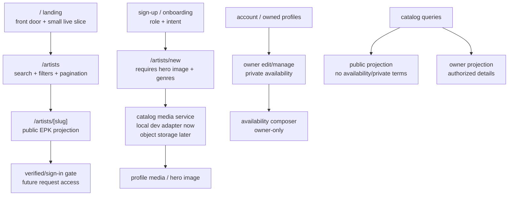

# Platform Foundation Recovery

## Summary

This plan resets the next build slice around foundation recovery: stop ad hoc UI patching, restore the product contracts in the foundation docs, and rebuild the public surfaces from the `ui-testing/showman-v2` baseline with orange replacing red. The work should land in stabilization-first order: data and routing contracts, media/profile gates, auth, then browser-verified UI.

---

## Problem Frame

The current app has drifted away from the stated architecture and visual baseline. Landing, discovery, artist profiles, media, auth, and migrations were changed in a reactive loop, which produced regressions and a UI that neither matches `ui-testing/showman-v2` nor honors the foundation docs.

The recovery target is not another cosmetic pass. It is a smaller, stricter product foundation where artist media is first-class, public browsing is separated from private booking data, `/artists` is a real directory, onboarding recognizes both supply and demand actors, and every visible change is checked in a browser before it is treated as done.

---

## Requirements

**Product and architecture**

- R1. Public landing must be a front door and preview of live platform activity, not the full artist browsing surface.
- R2. `/artists` must be the real artist directory route with search and filters, because all artists cannot live on the landing page.
- R3. Artist cards and public listings must never expose private availability, booking terms, raw location strategy, private floors, or owner/team details to anonymous visitors.
- R4. Artist profiles cannot be publicly useful without hero media; creation must require an image upload and public discovery must not show blank unusable profiles.
- R5. Artist genre capture must support one broad searchable category plus multiple specific scene/artist-defined genres.
- R6. Onboarding must stop assuming one side of the marketplace; it needs a role/intent foundation for artist/team/manager and booker/promoter/venue users.
- R7. Auth must work on the active local preview origin without breaking when the dev server port changes across `3000`-`3005`.

**Design and interaction**

- R8. The visual baseline must come from `ui-testing/showman-v2`, with orange replacing red, instead of invented card/dashboard patterns.
- R9. The UI must feel breathable and music-native: large editorial type, fixed grain/fluid background, image-led artist cards, reveal motion, and direct utility search.
- R10. Motion and hover effects must be implemented where they improve comprehension, including a fluid orange hover treatment on the main hero text when feasible.
- R11. Calendar and availability controls must expose obvious clickable affordances, cursor states, and labels that do not feel like generic admin badges.

**Engineering quality**

- R12. Schema changes must be migration-driven; runtime DDL guards in request paths are not allowed.
- R13. Media storage must not be treated as a production-ready local filesystem feature; uploaded media needs a storage abstraction with a durable production path.
- R14. Existing local database state and migration metadata must be reconciled so fresh databases and already-mutated dev databases both work.
- R15. Playwright or equivalent browser QA must run for every public surface touched by this recovery pass, including desktop and mobile screenshots.
- R16. The build journal must be updated whenever this plan is executed in a later turn.

---

## Key Technical Decisions

- KTD1. **Recovery before feature expansion:** Fix the contracts that make the current app unstable before adding booking, payments, org/RBAC, or public mobile APIs. This reduces the whackamole pattern and gives future API-first work a cleaner module surface.
- KTD2. **Landing is not the directory:** Landing shows a small curated live slice and sends discovery intent to `/artists`; `/artists` owns filtering, search, pagination, and full-card browsing.
- KTD3. **Media is part of the profile contract:** `imageUrl` as a nullable loose column is insufficient as the final model. The next slice should introduce a `ProfileMedia`-shaped path aligned with `docs/foundation/08-profiles-pitches-discovery.md`, even if phase 0 only supports one hero image.
- KTD4. **Public visibility requires presentable media:** New artist creation requires a hero image. Existing profiles without media are hidden from public discovery and surfaced to owners as incomplete/draft repair work.
- KTD5. **Local uploads are a development adapter only:** Store uploaded files through a `catalog` media service interface. Local disk can remain the dev adapter, but the code and docs must make object storage the production adapter.
- KTD6. **Privacy gates are server-owned:** Public queries should return only public projection fields. Owner-only queries can include availability windows and edit/manage links after authorization.
- KTD7. **Testing UI is the implementation reference:** Reuse the structural choices in `ui-testing/showman-v2/index.html` and `style.css`: fixed grain, fluid canvas, blurred nav, large uppercase hero, italic editorial accent, search utility, image-led artist grid, and marquee-style booker signal.
- KTD8. **Browser evidence is part of the definition of done:** Typecheck and lint are not enough for this app. A change to landing, directory, profile, auth, onboarding, or availability must include screenshots or Playwright assertions.

---

## Scope Boundaries

**In scope**

- Stabilizing current schema, migrations, auth origins, profile creation, profile display, landing, directory, and browser QA.
- Implementing a phase-0 media upload path that is honest about development vs. production storage.
- Creating the minimum role/intent foundation needed for sign-up/onboarding copy and routing.
- Rebuilding the public visual baseline from `ui-testing/showman-v2` with orange as the accent.

**Deferred for later**

- Full org/RBAC, roster transfer, verified authority, escrow, contracts, negotiation, payments, and booking request flows.
- Native iOS implementation. The recovery plan should keep module boundaries mobile-friendly, but this slice does not build the app client.
- Full object-storage provider integration if credentials/provider choice are not available during implementation. The service boundary and production requirement must still be present.

**Outside this recovery**

- Fake celebrity endorsement or launch-facing likeness usage. Any development demo images must be documented as temporary and must not become production seed data.
- More one-off visual experiments that do not flow from the prototype baseline or foundation docs.

---

## High-Level Technical Design

The implementation should treat public read models and owner management models as different projections. Public landing and directory surfaces call public catalog queries. Owner pages call authorized catalog operations. Media upload is handled by a catalog-owned service so the web form does not know whether storage is local development disk or object storage.

---

## Implementation Units

### U1. Reconcile Schema and Migration State

- **Goal:** Make the database path boring again: no runtime DDL, no missing migration metadata, and no page crash when new profile fields are selected.
- **Files:** `web/db/schema.ts`, `web/db/migrations/0004_artist_profile_media.sql`, `web/db/migrations/meta/_journal.json`, `web/db/migrations/meta/0004_snapshot.json`, `web/db/migrate.ts`.
- **Patterns:** Follow existing Drizzle migration files under `web/db/migrations/` and keep the request path out of schema repair.
- **Test Scenarios:**
  - Fresh database migrates from `0000` through `0004` and `web/app/page.tsx` can query the selected columns.
  - Existing database that already has `image_url`, `primary_genre`, and `genres` does not fail when migration `0004` runs.
  - No app page, query, or server action issues `ALTER TABLE` or schema repair during render.
- **Verification:** `cd web && npx tsx db/migrate.ts`, `cd web && npx tsc --noEmit`, and a fresh-db migration rehearsal.

### U2. Replace Loose Image Handling with a Catalog Media Contract

- **Goal:** Make artist media a required, owned part of the profile creation flow, with production storage not hidden behind a local filesystem assumption.
- **Files:** `web/db/schema.ts`, `web/server/catalog/uploads.ts`, `web/server/catalog/mutations.ts`, `web/server/catalog/types.ts`, `web/app/artists/new/page.tsx`, `web/app/artists/[slug]/edit/page.tsx`, `web/.env.example`, `web/README.md`.
- **Patterns:** Align with `ProfileMedia` from `docs/foundation/08-profiles-pitches-discovery.md` while keeping phase 0 to one `isHero` photo if that is all the UI needs.
- **Test Scenarios:**
  - Creating an artist without an image fails before any DB insert.
  - Creating an artist with a valid image stores the media through the media service and persists a public hero reference.
  - Updating text fields without replacing an existing hero image succeeds.
  - Replacing the hero image updates the public card and profile projection.
  - Unsupported file type and oversize upload return actionable errors without orphaning profile rows.
- **Verification:** Add server-side mutation tests if a test harness exists; otherwise add focused gate tests under `web/tests/gates.test.mjs` plus Playwright form coverage.

### U3. Define Public, Directory, and Owner Catalog Projections

- **Goal:** Stop leaking private booking data by making public and owner data flows separate at the query layer.
- **Files:** `web/server/catalog/queries.ts`, `web/server/catalog/types.ts`, `web/app/page.tsx`, `web/app/artists/page.tsx`, `web/app/artists/[slug]/page.tsx`, `web/app/artists/[slug]/availability/page.tsx`.
- **Patterns:** Use the module-boundary direction in `docs/foundation/09-system-architecture.md`; web pages call typed catalog functions rather than selecting all profile fields directly.
- **Test Scenarios:**
  - Anonymous public artist queries include stage name, slug, hero image, broad genre, specific genres, short public descriptor, and safe trust placeholders only.
  - Anonymous public artist queries exclude availability windows, owner IDs, detailed booking regions, notes, private terms, and management controls.
  - Owner profile pages can load availability and manage controls only for the owning session.
  - Profiles missing required public media are not returned in public directory results but remain visible to their owner as incomplete.
- **Verification:** Extend `web/tests/gates.test.mjs` with privacy assertions and run Playwright on anonymous and signed-in paths.

### U4. Restore Route Architecture: Landing Front Door and `/artists` Directory

- **Goal:** Make navigation and information architecture match the platform shape: landing introduces, `/artists` browses, artist detail evaluates, owner pages manage.
- **Files:** `web/components/site-header.tsx`, `web/app/page.tsx`, `web/app/artists/page.tsx`, `web/app/artists/[slug]/page.tsx`, `web/app/account/page.tsx`.
- **Patterns:** Foundation docs `08` and `10`: discovery is utility search over a verified catalog, not a feed and not a one-page showcase.
- **Test Scenarios:**
  - Header `Artists` always links to `/artists`.
  - Landing search submits to `/artists?q=...`.
  - `/artists` supports query text and broad genre filters without relying on hardcoded homepage arrays.
  - Landing renders at most a small live slice and links to the full directory.
  - Artist detail has a public EPK projection and does not show private availability to anonymous users.
- **Verification:** Playwright route tests for `/`, `/artists`, filtered `/artists?q=...`, and `/artists/[slug]`.

### U5. Rebuild Public UI from `ui-testing/showman-v2`

- **Goal:** Replace the current generic/vibecoded look with the simpler prototype baseline, using orange instead of red.
- **Files:** `web/app/globals.css`, `web/app/page.tsx`, `web/app/artists/page.tsx`, `web/app/artists/[slug]/page.tsx`, `web/components/landing/fluid-background.tsx`, `web/components/landing/reveal-on-scroll.tsx`, `web/components/landing/home-artist-experience.tsx`, `web/components/site-header.tsx`.
- **Patterns:** Source reference is `ui-testing/showman-v2/index.html` and `ui-testing/showman-v2/style.css`: `--obsidian`, `--bone`, fixed grain, fluid canvas, `nav-blur`, uppercase large hero, italic editorial accent, rounded search utility, image-first artist cards, hover image scale, reveal motion.
- **Test Scenarios:**
  - Desktop landing has scroll depth below the hero and does not feel like a single static screen.
  - Mobile landing keeps the hero, search, artist preview, and booker lane readable without overlap.
  - Hero hover orange treatment does not block text selection, degrade reduced-motion users, or tank render performance.
  - Directory cards are image-led and do not render blank profile blocks.
  - Public profile page uses image/media as the first visual signal and keeps private booking details out.
- **Verification:** Playwright screenshots at desktop and mobile for `/`, `/artists`, and one public artist route; compare against `ui-testing/showman-v2` direction before claiming completion.

### U6. Repair Artist Creation and Edit UX

- **Goal:** Make the artist creation form match the data that public profiles display instead of being a thin admin form.
- **Files:** `web/app/artists/new/page.tsx`, `web/app/artists/[slug]/edit/page.tsx`, `web/lib/artist-genres.ts`, `web/server/catalog/types.ts`, `web/server/catalog/mutations.ts`, `web/components/ui/form.tsx`.
- **Patterns:** Keep controlled broad categories for search and allow multiple specific genres for culture-native self-description.
- **Test Scenarios:**
  - Broad genre is selected from a controlled list.
  - Specific genres accept multiple values and preserve entries like `Rage-Rap` while still mapping to broad `Hip-Hop/Rap`.
  - The form previews the hero image before submit.
  - Server validation matches the UI validation for required stage name, broad genre, and image.
  - Saved details are visible on the public projection only when they are public-safe.
- **Verification:** Playwright create/edit flow with image upload and genre selection.

### U7. Stabilize Auth Origins and Onboarding Intent

- **Goal:** Fix local sign-in/sign-up and introduce the minimum role/intent foundation without pretending full RBAC exists.
- **Files:** `web/lib/auth.ts`, `web/.env.example`, `web/app/sign-up/page.tsx`, `web/app/sign-in/page.tsx`, `web/app/account/page.tsx`, `web/db/schema.ts`.
- **Patterns:** `docs/foundation/07-roster-org-rbac.md` says real authority is principal-based; phase 0 can capture intent without claiming final org membership behavior.
- **Test Scenarios:**
  - Sign-up and sign-in work from `http://localhost:3000` through `http://localhost:3005`.
  - `BETTER_AUTH_TRUSTED_ORIGINS` remains additive and does not erase local preview origins.
  - Sign-up role intent distinguishes artist/team/manager from booker/promoter/venue.
  - Account page routes artist-side users toward artist/profile completion and booker-side users toward the future request/onboarding lane.
- **Verification:** Playwright auth flow on the active dev server port and server-side config tests where practical.

### U8. Availability and Location UX Follow-Through

- **Goal:** Keep the repaired calendar affordance but make location and travel terms less brittle than free text.
- **Files:** `web/components/availability/availability-composer.tsx`, `web/lib/booking-locations.ts`, `web/app/artists/[slug]/availability/actions.ts`, `web/server/catalog/mutations.ts`.
- **Patterns:** Existing `booking-locations` starter data can stay, but the UX should make structured selections obvious and clickable.
- **Test Scenarios:**
  - Date cells show pointer cursor, selected range state, and clear open/blocked wording.
  - Location selection comes from controlled chips or selects rather than raw `market` typing.
  - Travel terms are captured in a structured way even if phase 0 persists them in an interim field.
  - Anonymous public users cannot access or infer detailed availability windows.
- **Verification:** Existing Playwright availability flow plus mobile screenshot.

### U9. Add Browser QA and Review Gates

- **Goal:** Make visual/browser review mandatory so implementation cannot drift invisibly again.
- **Files:** `playwright.config.js`, `tests/example.spec.js`, `web/tests/gates.test.mjs`, `.github/workflows/playwright.yml`, `docs/BUILD-JOURNAL.md`.
- **Patterns:** Keep Playwright checks focused on user-critical pages and privacy gates rather than brittle pixel snapshots only.
- **Test Scenarios:**
  - Landing loads and screenshot captures desktop/mobile.
  - `/artists` loads with search/filter controls and no blank cards.
  - Sign-up/sign-in works from the active preview origin.
  - Artist creation with upload works.
  - Anonymous artist profile does not show availability/private fields.
  - Owner can manage availability for owned profile.
- **Verification:** Local Playwright run and CI Playwright job where environment allows browser install.

---

## Acceptance Examples

- AE1. Given a visitor opens `/`, when they click `Artists`, then they land on `/artists` instead of jumping to an in-page section.
- AE2. Given 100 public-ready artists exist, when a visitor opens `/`, then only a small featured/live slice appears and the full set is browsed through `/artists`.
- AE3. Given an artist has no hero image, when an anonymous visitor opens `/artists`, then that artist is not rendered as a blank public card.
- AE4. Given an owner has an incomplete artist profile, when they open their account or edit page, then they see a repair path to add required media.
- AE5. Given an anonymous visitor opens an artist profile, when the page renders, then raw availability windows, booking notes, owner IDs, and private booking data are absent.
- AE6. Given a signed-in owner opens their own artist availability page, when they select dates, then the calendar is visibly clickable and submits a valid window.
- AE7. Given the dev server runs on `3004`, when a user signs up, then Better Auth does not reject the origin.
- AE8. Given implementation changes the landing UI, when the turn ends, then desktop and mobile Playwright screenshots exist or the blocker is explicitly documented.

---

## System-Wide Impact

This recovery touches the public product contract, database shape, auth configuration, and visual system. It should be treated as a stabilization branch rather than ordinary polish. The most important system-wide effect is separating public marketplace projections from owner management projections, because that boundary protects artist privacy now and becomes the base for verified-booker access later.

The media service boundary also matters for future mobile/API-first work. iOS should eventually call the same catalog/media contracts instead of depending on page-local upload logic.

---

## Risks & Dependencies

| Risk | Mitigation |
| --- | --- |
| Existing dev DB has manual columns not reflected in migration snapshots. | Rehearse both fresh migration and idempotent existing-db migration; add missing snapshot metadata. |
| Browser tooling remains blocked by sandbox/browser install constraints. | Keep Playwright tests in repo, run what local environment allows, and document any blocked screenshot pass in `docs/BUILD-JOURNAL.md`. |
| Media storage provider is not selected. | Build a storage adapter interface now; local disk is dev-only, object storage is the documented production adapter. |
| UI rebuild becomes another visual experiment. | Treat `ui-testing/showman-v2` as the baseline and require screenshots against that direction before further style iteration. |
| Role/onboarding work overclaims final RBAC. | Capture user intent only; defer real `Org`/`Membership` authority until the RBAC implementation slice. |

---

## Documentation and Operational Notes

- Update `docs/BUILD-JOURNAL.md` after each implementation turn that executes this plan.
- Update `web/README.md` with media storage setup, local preview origins, and Playwright/browser QA commands.
- If development demo images use celebrity likenesses, document them as local-only test assets and keep them out of production seed data.
- Any future PR should include a short “foundation contracts checked” section: public/private projection, media requirement, route architecture, auth, and browser screenshots.

---

## Sources and Existing Patterns

- `docs/foundation/08-profiles-pitches-discovery.md` defines ArtistProfile EPK, `ProfileMedia`, public discovery, visibility, and the two-zone trust rule.
- `docs/foundation/09-system-architecture.md` defines the modular monolith, catalog module, object storage, and module-owned service interfaces.
- `docs/foundation/10-design-direction-ux.md` defines visual principles, responsive discovery/EPK behavior, and privacy-safe public surfaces.
- `docs/foundation/07-roster-org-rbac.md` defines actor-vs-principal authority and explains why signup/onboarding cannot remain one-sided.
- `ui-testing/showman-v2/index.html` and `ui-testing/showman-v2/style.css` define the immediate UI baseline to port: raw music-native landing, fixed grain/fluid background, image-led cards, reveal motion, and simple search utility.
- `web/server/catalog/queries.ts` and `web/server/catalog/mutations.ts` are the current catalog boundary to preserve and harden.
- `web/app/page.tsx`, `web/app/artists/page.tsx`, and `web/app/artists/[slug]/page.tsx` are the public routes most affected by the recovery.
