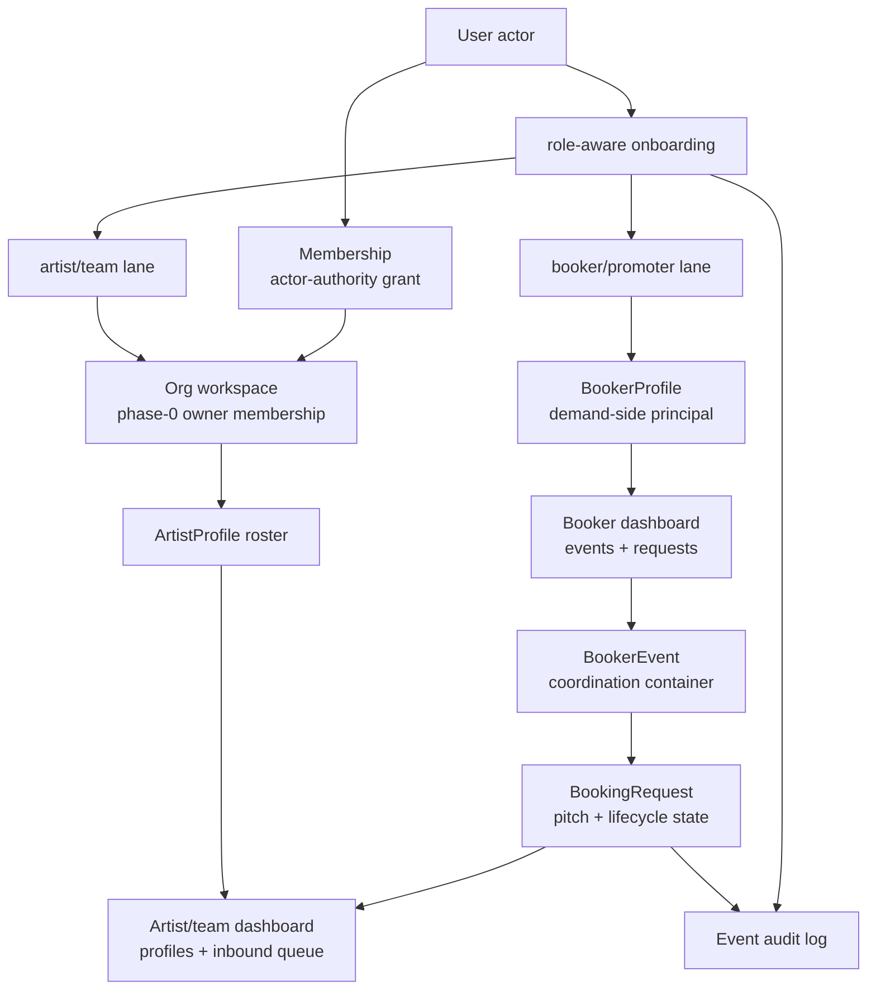

# Onboarding and Booking Workflow Foundation

## Summary

This plan moves showman from public profile recovery into the first real workflow foundation: role-aware onboarding, booker profiles, booker-side event coordination, artist/team dashboard queues, and a booking request spine backed by database tables instead of hardcoded page copy.

---

## Problem Frame

The current app is still Phase 0: Better Auth users, user-owned `ArtistProfile`s, manual `AvailabilityWindow`s, public catalog projections, and a simple onboarding-intent field. That was enough to stabilize the landing and public artist surfaces, but it does not yet explain how bookers benefit, how artist teams coordinate inbound interest, or how the eventual booking state machine will be represented in data.

The next step should not jump to escrow, contracts, or integrations. It should establish the principals and workflow records that make those later systems fit: a booker needs a dossier and an event/request workspace; an artist or team needs a dashboard for inbound requests and roster coordination; every request should be traceable as actor-on-principal activity with an event log.

---

## Assumptions

- The implementation remains a modular monolith in the existing Next.js app, matching `docs/foundation/09-system-architecture.md`.
- Drizzle/Postgres remains the persistence layer for this phase.
- Full `Org`/`Membership` RBAC is introduced as a minimal phase-0 version now, with enough structure to avoid painting future authority into a corner.
- Booking requests in this phase are workflow records and dashboards, not legally binding deals. They stop before offers, e-sign, deposit capture, and confirmation.
- Booker onboarding creates a booker dossier and optional event workspace before payment/KYB is live.
- Public artist pages continue to expose only public-safe catalog projections.

---

## Requirements

**Onboarding and identity**

- R1. Sign-up must distinguish at least artist/team and booker/promoter intent, then route each user into a lane-specific onboarding checklist.
- R2. Artist-side onboarding must create or attach to a supply-side workspace that can later become an `Org` with `Membership`s.
- R3. Booker-side onboarding must create a `BookerProfile` with display name, type, market, role/title, and credibility summary fields.
- R4. Onboarding must be resumable from `/account` without relying on query strings as source of truth.

**Booker workflow**

- R5. Bookers must have a dashboard that shows their dossier, event briefs, draft requests, sent requests, active requests, and upcoming booked/confirmed placeholders.
- R6. A booker must be able to start a request from a public artist/profile action and carry the selected artist into a structured request brief.
- R7. Request creation must collect event name, event type, venue/market, target date, capacity band, budget band, and free-text pitch.
- R8. Request records must be attached to a booker principal and an artist principal, not just an arbitrary user.

**Artist/team workflow**

- R9. Artist-side users must have a dashboard separate from the public artist directory, with owned profiles, incomplete profile repairs, inbound request queue, calendar attention items, and upcoming booking placeholders.
- R10. Artist/team dashboard data must be scoped to profiles the actor is authorized to manage.
- R11. Inbound request previews must show the booker dossier and pitch facts without exposing hidden floors or future private booking terms.

**Booking foundation**

- R12. The app must introduce a `BookingRequest` foundation with lifecycle states that align with the foundation docs, even if this phase only uses `draft`, `request_sent`, `declined`, and `cancelled`.
- R13. The app must introduce an append-only `Event` audit record for booking/onboarding actions before money, contracts, or confirmations are added.
- R14. Dashboard counts and lists must read from live database rows, not hardcoded homepage examples.
- R15. The homepage artist preview modal must prevent background page content from scrolling over or covering the preview.

**Operations and verification**

- R16. Documentation must explain the current database setup, required environment variables, migration commands, and what remains before production money can move.
- R17. Tests must cover onboarding routing, booker profile creation, request creation, public/private projection safety, and dashboard access control.
- R18. Playwright browser tests must cover the fixed homepage modal, booker onboarding/request flow, and artist dashboard inbound queue on desktop and mobile where feasible.

---

## Key Technical Decisions

- KTD1. **Principals before transactions:** Add `Org`, `Membership`, `BookerProfile`, `BookingRequest`, and `Event` foundations before offers, contracts, holds, or payments. This honors the actor-vs-principal model in `docs/foundation/02-domain-model.md`.
- KTD2. **Minimal RBAC now, full RBAC later:** Model `Org` and `Membership` with the canonical role names now, but implement only owner-level authorization for this phase. The database shape stays compatible with `docs/foundation/07-roster-org-rbac.md`.
- KTD3. **Booker dashboard is event-centered:** Demand-side value starts with organizing events and requests, not browsing alone. Booker workflow data should be grouped around event briefs and request statuses.
- KTD4. **Artist dashboard is queue-centered:** Supply-side value starts with profile readiness, inbound request triage, and calendar attention, not a generic account page.
- KTD5. **Requests are not bookings yet:** A `BookingRequest` in this phase is an intent/pitch record. It can later spawn `Offer`, `Agreement`, `Hold`, `Deposit`, and `Confirmation`, but those entities stay deferred.
- KTD6. **Append-only events are introduced early:** Even simple request creation and profile onboarding should emit events so later notifications, audit, and dashboard timelines have a durable seam.
- KTD7. **No hardcoded showcase data:** Landing and dashboards may show empty states, but real lists must come from database queries.
- KTD8. **Browser QA remains required:** UI behavior such as the modal-scroll bug and dashboard routing must be verified in a browser, not inferred from typecheck.

---

## High-Level Technical Design

This is intentionally a pre-transaction architecture. The request object connects booker and artist principals and records pitch intent. Later work can attach offers, agreements, holds, escrow, confirmations, notifications, and integrations to this spine without replacing it.

---

## Implementation Units

### U1. Fix Homepage Artist Preview Layering

- **Goal:** Repair the modal bug immediately so background sections cannot scroll over or visually cover the selected artist preview.
- **Requirements:** R15, R18.
- **Dependencies:** None.
- **Files:** `web/components/landing/home-artist-experience.tsx`, `web/app/globals.css`, `tests/showman.spec.js`.
- **Approach:** Lock background scroll while the preview is open, ensure the modal has a top-level stacking context above all landing sections, and make close behavior keyboard and pointer friendly.
- **Patterns to follow:** Existing `HomeArtistExperience` modal and `raw-modal` styles.
- **Test scenarios:**
  - On landing, clicking an artist opens the preview above all sections.
  - Scrolling while preview is open does not allow the bookers section to cover the preview.
  - Escape or close button closes the preview and restores page scroll.
- **Verification:** Playwright desktop and mobile check of the landing modal.

### U2. Add Principal and Workflow Schema

- **Goal:** Add the minimum database entities for role-aware onboarding and request dashboards.
- **Requirements:** R2, R3, R8, R12, R13, R14, R16.
- **Dependencies:** None.
- **Files:** `web/db/schema.ts`, `web/db/migrations/0006_workflow_foundation.sql`, `web/db/migrations/meta/_journal.json`, `web/db/migrations/meta/0006_snapshot.json`, `web/server/identity/types.ts`, `web/server/booking/types.ts`.
- **Approach:** Introduce `orgs`, `memberships`, `booker_profiles`, `booker_events`, `booking_requests`, and `events`. Keep current `artist_profiles.owner_user_id` for compatibility while adding optional org ownership where safe.
- **Patterns to follow:** Existing Drizzle schema and migration metadata conventions under `web/db/migrations/`.
- **Test scenarios:**
  - Fresh database migrates through the new workflow tables.
  - A user can own a phase-0 org through an active owner membership.
  - A booker profile can be created for a user and referenced by a request.
  - Event rows are append-only at the application layer.
- **Verification:** Typecheck, migration rehearsal, and focused data-access tests or gate tests.

### U3. Introduce Identity and Authorization Services

- **Goal:** Stop scattering ownership checks by adding a small identity module for onboarding principals and phase-0 authorization.
- **Requirements:** R2, R4, R10, R13.
- **Dependencies:** U2.
- **Files:** `web/server/identity/queries.ts`, `web/server/identity/mutations.ts`, `web/server/identity/authorize.ts`, `web/server/events/mutations.ts`, `web/lib/session.ts`, `web/app/account/page.tsx`.
- **Approach:** Provide helpers for ensuring a personal org, creating owner membership, getting the actor's memberships, and authorizing owner/agent-style actions over org-owned artist profiles. Emit events for principal creation and onboarding completion.
- **Patterns to follow:** Current `web/server/catalog` boundary, with the single `authorize()` direction from `docs/foundation/07-roster-org-rbac.md`.
- **Test scenarios:**
  - Artist-lane user gets a personal org and owner membership.
  - Re-running onboarding does not duplicate the user's personal org.
  - Unauthorized user cannot see or manage another user's artist dashboard data.
  - Principal creation emits an audit event with actor and principal references.
- **Verification:** Unit or gate tests for idempotent onboarding and authorization denial.

### U4. Build Role-Aware Onboarding

- **Goal:** Replace bland sign-up/account routing with a lane-specific onboarding flow that creates real underlying principals.
- **Requirements:** R1, R2, R3, R4.
- **Dependencies:** U2, U3.
- **Files:** `web/app/onboarding/page.tsx`, `web/app/onboarding/actions.ts`, `web/components/onboarding/onboarding-flow.tsx`, `web/app/sign-up/page.tsx`, `web/components/sign-up-form.tsx`, `web/app/account/page.tsx`.
- **Approach:** After sign-up, route to `/onboarding`. Artist/team users create or confirm their workspace and first artist-profile next step. Booker users create their `BookerProfile` and can optionally seed a first event brief.
- **Patterns to follow:** Current Better Auth sign-up flow and form component patterns, but server state becomes authoritative.
- **Test scenarios:**
  - Sign-up with artist/team intent routes to onboarding and persists that lane.
  - Sign-up with booker/promoter intent routes to onboarding and creates a booker profile.
  - Returning to `/account` shows the correct lane from stored server state.
  - Direct `/sign-up?role=booker&artist=<slug>` carries the requested artist into the booker onboarding flow without trusting it for authorization.
- **Verification:** Playwright sign-up/onboarding flow for both lanes.

### U5. Add Booker Dashboard and Event Briefs

- **Goal:** Give bookers an actual workflow surface for organizing events and requests.
- **Requirements:** R5, R6, R7, R8, R14.
- **Dependencies:** U2, U3, U4.
- **Files:** `web/app/booker/page.tsx`, `web/app/booker/events/new/page.tsx`, `web/app/booker/events/actions.ts`, `web/app/booker/requests/new/page.tsx`, `web/app/booker/requests/actions.ts`, `web/server/booking/queries.ts`, `web/server/booking/mutations.ts`, `web/components/booker/booker-dashboard.tsx`, `web/components/booker/request-brief-form.tsx`.
- **Approach:** Create a dashboard with live counts/lists for event briefs and requests. Request creation may start from an artist slug, then asks the booker to choose/create an event and write a structured pitch.
- **Patterns to follow:** `docs/foundation/08-profiles-pitches-discovery.md` pitch shape and `docs/foundation/10-design-direction-ux.md` decision-surface principles.
- **Test scenarios:**
  - Booker with no profile is redirected to onboarding before using the dashboard.
  - Booker can create an event brief with market, venue, target date, event type, and capacity band.
  - Booker can start a request from an artist and save it as draft or sent.
  - Booker dashboard shows live request status counts from database rows.
- **Verification:** Gate tests for create/list behavior and Playwright for request creation.

### U6. Add Artist/Team Dashboard and Inbound Queue

- **Goal:** Replace the generic account profile list with a real supply-side workspace.
- **Requirements:** R9, R10, R11, R14.
- **Dependencies:** U2, U3, U5.
- **Files:** `web/app/team/page.tsx`, `web/components/team/team-dashboard.tsx`, `web/server/booking/queries.ts`, `web/server/catalog/queries.ts`, `web/app/account/page.tsx`.
- **Approach:** Add a `/team` dashboard showing owned/managed artist profiles, profile completeness, availability attention, and inbound requests grouped by status. Keep actions minimal: view request, decline/cancel placeholder, and link to profile/calendar management.
- **Patterns to follow:** Existing catalog owner queries plus authorization service from U3.
- **Test scenarios:**
  - Artist-side user sees only requests for their managed profiles.
  - Anonymous user is redirected from `/team`.
  - Booker-side user without artist authority does not see another artist's inbound queue.
  - Inbound cards show booker profile, event facts, and pitch summary without hidden artist-side terms.
- **Verification:** Access-control gate tests and Playwright dashboard smoke.

### U7. Wire Request Access CTAs to Real Request Creation

- **Goal:** Make public artist CTAs feed the new workflow instead of ending at generic sign-up/account copy.
- **Requirements:** R6, R7, R8, R11.
- **Dependencies:** U4, U5, U6.
- **Files:** `web/components/landing/home-artist-experience.tsx`, `web/app/artists/[slug]/page.tsx`, `web/app/booker/requests/new/page.tsx`, `web/server/catalog/queries.ts`.
- **Approach:** Authenticated bookers go to the request-brief form with the artist preselected. Anonymous users go through sign-up/onboarding, then return to the same request intent after profile creation.
- **Patterns to follow:** Current `Request access` links and public catalog privacy projection.
- **Test scenarios:**
  - Anonymous request access stores/carries artist slug through sign-up and onboarding.
  - Authenticated booker opens request creation with the selected artist preloaded.
  - Artist-side user is guided to switch/create a booker profile before sending a request.
  - Public profile CTA does not expose availability internals.
- **Verification:** Playwright full path from artist preview to request form.

### U8. Document Database, Production Readiness, and Build Journal

- **Goal:** Make the database and production-readiness story understandable before more functionality is layered on.
- **Requirements:** R16.
- **Dependencies:** U2 through U7.
- **Files:** `web/README.md`, `docs/BUILD-JOURNAL.md`, `docs/foundation/CONSISTENCY-REVIEW.md`.
- **Approach:** Document local Postgres setup, migration flow, media storage, Better Auth origins, current workflow tables, and what is still required before production money/contracts/verification.
- **Patterns to follow:** Existing build journal format and foundation-doc boundaries.
- **Test scenarios:** Test expectation: none -- documentation-only unit.
- **Verification:** Documentation references match actual env vars, scripts, and table names.

### U9. Browser and Regression Test Coverage

- **Goal:** Add test coverage that keeps onboarding and workflow foundations from regressing while UI remains in flux.
- **Requirements:** R17, R18.
- **Dependencies:** U1 through U7.
- **Files:** `web/tests/gates.test.mjs`, `tests/showman.spec.js`, `playwright.config.js`, `.github/workflows/playwright.yml`.
- **Approach:** Extend existing gate tests for privacy and data behavior, then add browser tests for landing modal, onboarding lanes, booker dashboard, request creation, and artist inbound queue.
- **Patterns to follow:** Existing Playwright setup and gate test style.
- **Test scenarios:**
  - Landing modal remains above all content during scroll.
  - Booker onboarding creates a dossier and routes to `/booker`.
  - Booker request creation creates a database row and appears on `/booker`.
  - Artist dashboard shows the inbound request for the selected artist and hides it from unauthorized users.
  - Public catalog still excludes incomplete/no-image profiles and private availability.
- **Verification:** Typecheck, lint, gate tests, and Playwright browser tests where the environment permits.

---

## Scope Boundaries

### In Scope

- Phase-0 `Org`/`Membership` foundation.
- `BookerProfile`, booker event briefs, and booking request records.
- Role-aware onboarding and lane-specific dashboards.
- Request-access routing from public artist surfaces into booker request creation.
- Modal layering bug fix.
- Documentation of database setup and production-readiness gaps.

### Deferred to Follow-Up Work

- Full role matrix enforcement beyond owner-style phase-0 permissions.
- `Listing`, `Offer`, `Agreement`, `Hold`, `EscrowBalance`, `Payment`, `Payout`, `Dispute`, `Confirmation`, and real deal-state transitions past request intent.
- Stripe Connect, Stripe Identity/Persona, DSP verification, e-sign vendors, object storage production provider wiring, email/push/Slack integrations, background workers, and transactional outbox processing.
- Native iOS client work. This phase strengthens server boundaries for future mobile, but it does not build a mobile app.
- Final visual polish. UI should remain usable and consistent, but this plan prioritizes workflow and architecture.

### Outside This Product's Identity

- Open DMs outside a request/deal context.
- Ticketing, social feed behavior, DSP functionality, or showman representing artists directly.
- Any workflow that exposes `private_floor`, raw availability internals, or private team/owner identity to public users.

---

## System-Wide Impact

This plan changes the product from account-owned profile CRUD toward actor/principal workflow modeling. It introduces durable tables that future money, verification, contract, and integration work will depend on, so migrations and naming must follow the foundation docs closely. It also changes navigation expectations: `/account` becomes an identity hub, while `/team` and `/booker` become the actual work surfaces.

---

## Risks and Dependencies

- **Migration correctness:** Manual Drizzle snapshot drift has caused issues before. The new migration must be verified against a fresh database and an existing dev database.
- **Scope creep into transactions:** It will be tempting to add offers, holds, and confirmations while building requests. Keep this phase to intent, pitch, dashboards, and audit records.
- **Authorization under-modeling:** A simple owner-only check is acceptable only if the schema preserves the real `Membership`/role path.
- **Onboarding runtime behavior:** Better Auth session timing after client sign-up has been fragile. Browser tests must verify the redirect and server action sequence.
- **Visual distraction:** UI should not return to generic dashboard cards, but the work should not stall on final aesthetics while core workflows are missing.

---

## Sources and Research

- `docs/foundation/02-domain-model.md` for actor-vs-principal, `Org`, `Membership`, `BookerProfile`, `BookingRequest`, and `Event`.
- `docs/foundation/05-negotiation-deal-lifecycle.md` for the canonical booking state machine and request/offer boundaries.
- `docs/foundation/06-availability-confirmation.md` for the no-auto-confirm and no-double-booking rules.
- `docs/foundation/07-roster-org-rbac.md` for `Org`, `Membership`, and role semantics.
- `docs/foundation/08-profiles-pitches-discovery.md` for `BookerProfile`, `Pitch`, EPK, and dossier surface requirements.
- `docs/foundation/09-system-architecture.md` for modular-monolith boundaries and the append-only `Event` log.
- `docs/foundation/10-design-direction-ux.md` for dashboard/decision-surface UX posture.
- `docs/plans/2026-06-26-001-platform-foundation-recovery.md` for the immediate stabilized baseline this work builds on.
