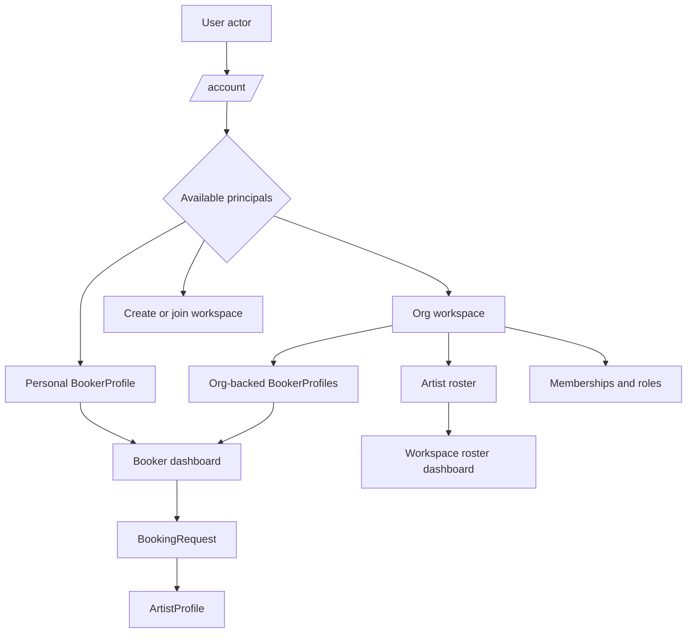

# Refactor Workspace Principal Foundation

## Summary

Refactor account, onboarding, and workflow routing so Showman is organized around principals and workspaces instead of a signed-in user's binary side. The first implementation should fix the visible account/dashboard confusion, then make booker and artist onboarding create the correct principal records for future production features.

---

## Problem Frame

The foundation docs are clear: `User` is the actor, while `Org`, `ArtistProfile`, and `BookerProfile` are the principals that carry authority, reputation, money, and deal state. The current app has begun adding those tables, but `/account`, sign-up, onboarding, and dashboards still present "artist/team" and "booker" as global account modes. That is why a booker-only account can see a team dashboard as a primary action.

The refactor should preserve the current modular monolith and live database-backed workflow, but make the routing model match the product model.

---

## Requirements

- R1. `/account` must render available workspaces and principals from database state, not unconditional dashboard choices.
- R2. A booker-only user must see the booker workspace as the primary route and must not be pushed toward a team dashboard.
- R3. An artist/team user must see their org/roster workspace as the primary route and must not be treated as a booker unless they create a booker principal.
- R4. A dual-capability user or org must be able to see both capabilities under the same workspace model without the app implying two separate accounts.
- R5. Booker drafts must remain private to the booker principal and must not appear in artist-team inbound queues.
- R6. Sign-up must create a human account only; product role/workspace setup belongs in onboarding.
- R7. Booker onboarding must support personal and org-backed buyer profiles.
- R8. Booker profile creation must collect enough dossier data for artist teams to size up a request, including image/logo and structured web/social/trust fields.
- R9. New artist profiles should attach to an org workspace. Direct `owner_user_id` behavior should remain only as legacy compatibility.
- R10. Public artist projections must avoid accidental exposure of private booking, raw availability, actor, and sensitive location details.
- R11. Tests must cover booker-only, artist/team-only, dual-capability, and no-workspace account states.
- R12. Docs must stay updated when the schema or workflow model changes.

---

## Key Technical Decisions

- **Account is an actor surface, not a role surface:** `/account` should show "who you can act as" instead of "which side are you." This follows `docs/foundation/02-domain-model.md`.
- **Workspace is the routing primitive:** `Org` should become the shared workspace container for artist roster, buyer faces, members, verification, and future billing. Personal booker profiles can remain directly user-owned as the one documented exception.
- **Remove `onboardingIntent` from routing decisions:** The field can be kept briefly for migration/backward compatibility, but new routing should use URL intent only for immediate flows and persisted principal records for durable state.
- **Booker profiles are principals:** Booker dashboards should load by selected `BookerProfile` or org-backed profile, not implicitly "the one profile owned by this user."
- **Legacy artist ownership is transitional:** Existing `owner_user_id` checks can remain until rows are migrated, but new artist creation should provision/select an owning org.
- **Public profile data gets a typed projection:** Public queries should return only fields intentionally allowed for anonymous/public viewers.

---

## High-Level Technical Design

The account hub becomes a workspace selector. Dashboards are reached through a selected principal or workspace, even if initial routes still use `/team` and `/booker` aliases for convenience.

---

## Implementation Units

### U0. Draft Visibility Hotfix

- **Goal:** Prevent private booker drafts from appearing in artist-team inbound queues.
- **Files:** `web/server/booking/queries.ts`, `web/tests/gates.test.mjs`, `tests/showman.spec.js` if browser coverage already seeds requests
- **Patterns:** Filter artist-team inbound queries to visible request states, starting with `request_sent`. Keep draft rows visible only to the owning booker principal.
- **Test Scenarios:** Saved draft does not appear in `/team`; sent request appears; unrelated booker drafts remain private.
- **Verification:** Focused integration test before any broader account/onboarding refactor.

### U1. Account Workspace Selector

- **Goal:** Replace unconditional account dashboard links with state-derived workspace cards.
- **Files:** `web/app/account/page.tsx`, `web/server/identity/queries.ts`, `web/server/identity/types.ts`, `web/components/site-header.tsx`
- **Patterns:** Follow `getActorWorkspace`, but enrich it to return org memberships, owned artist counts, and available booker profiles.
- **Test Scenarios:** Booker-only account shows booker profile and setup option for artist workspace; artist-team account shows org/roster and setup option for booker profile; empty account shows onboarding choice; dual account shows both capabilities without selecting one as global identity.
- **Verification:** Browser-check `/account` on seeded booker-only and artist-only users.

### U2. Sign-Up and Onboarding Entry Redesign

- **Goal:** Make sign-up account-only and move workspace creation into onboarding.
- **Files:** `web/components/sign-up-form.tsx`, `web/app/sign-up/page.tsx`, `web/app/sign-up/actions.ts`, `web/app/onboarding/page.tsx`, `web/components/onboarding/onboarding-flow.tsx`, `web/app/onboarding/actions.ts`
- **Patterns:** Do not depend on `user.onboarding_intent` for durable routing. Preserve query params like `artist=<slug>` only as a one-time flow hint.
- **Test Scenarios:** New sign-up redirects to onboarding without freezing; booker request flow can carry selected artist into onboarding; returning user with existing principals lands on account selector.
- **Verification:** Manual sign-up through localhost plus server-action error path review.

### U3. Org-Backed Booker Profiles

- **Goal:** Support personal booker profiles and org-backed buyer profiles.
- **Files:** `web/db/schema.ts`, new migration under `web/db/migrations/`, `web/server/identity/mutations.ts`, `web/server/identity/queries.ts`, `web/server/booking/queries.ts`, `web/server/booking/mutations.ts`
- **Patterns:** Keep personal booker direct ownership; for org-backed profiles, authorize through active org membership.
- **Test Scenarios:** A festival org owner creates a booker profile; a member with active role can see it; unrelated users cannot create events or requests under it; one org can have multiple booker profiles.
- **Verification:** Migration on fresh Postgres and existing local database.

### U4. Booker Dossier Fields and Upload

- **Goal:** Expand booker onboarding with image/logo upload, website, socials, buyer type, organization affiliation, market coverage, and track record fields.
- **Files:** `web/db/schema.ts`, `web/server/identity/mutations.ts`, `web/components/onboarding/onboarding-flow.tsx`, new upload helper near `web/server/catalog/uploads.ts` or a shared upload module
- **Patterns:** Reuse the artist image upload approach while separating dev/local uploads from future production object storage.
- **Test Scenarios:** Required fields validate; image upload persists; update replaces old image; invalid uploads are rejected; empty optional social fields do not break rendering.
- **Verification:** Browser form test plus filesystem/upload cleanup checks.

### U5. Artist Workspace Ownership Path

- **Goal:** Make new artist profiles attach to an org workspace and reduce new reliance on `owner_user_id`.
- **Files:** `web/app/artists/new/page.tsx`, `web/server/catalog/mutations.ts`, `web/server/identity/authorize.ts`, `web/components/team/team-dashboard.tsx`
- **Patterns:** Use or create a one-person org for self-managed artists. Keep direct owner checks only for existing legacy rows.
- **Test Scenarios:** New artist from a no-workspace user creates personal org; new artist from an existing org attaches to that org; org members with owner/agent roles can manage; direct legacy row remains editable by its owner.
- **Verification:** Fresh database flow and legacy seeded row flow.

### U6. Public Projection Cleanup

- **Goal:** Separate public artist data from signed-in/request-time data.
- **Files:** `web/server/catalog/queries.ts`, `web/app/artists/[slug]/page.tsx`, `web/app/artists/page.tsx`, `web/components/landing/home-artist-experience.tsx`
- **Patterns:** Add explicit public DTOs with only allowed fields. Keep request-time details behind authenticated/verified flows later.
- **Test Scenarios:** Anonymous pages render only public fields; signed-in booking request flow still has the data it needs; no raw availability internals leak through public query types.
- **Verification:** Snapshot or DOM assertions for anonymous public pages.

### U7. Route and Workflow Tests

- **Goal:** Add guardrail tests for the actor/principal cases that caused this regression.
- **Files:** `web/tests/gates.test.mjs`, `tests/showman.spec.js`, possible test seed helpers under `web/tests/`
- **Patterns:** Prefer focused integration tests over fragile visual-only assertions.
- **Test Scenarios:** No-workspace, booker-only, artist-team-only, dual-capability, draft-private, sent-request-visible, and unauthorized cross-user access.
- **Verification:** `npm run test` where available, plus Playwright against port 3004.

### U8. Documentation Updates

- **Goal:** Keep build process and model docs aligned with the refactor.
- **Files:** `docs/BUILD-JOURNAL.md`, `docs/architecture/current-erd.md`, `web/README.md`
- **Patterns:** Document current schema and migration/run requirements each turn.
- **Test Scenarios:** Not code-tested; review for consistency with foundation docs.
- **Verification:** Read-through after implementation.

---

## Scope Boundaries

Deferred for later:

- Stripe Connect, escrow, contract signing, payout, and dispute rails.
- Full verification/KYC/KYB provider integrations.
- Complete `Listing`, `Offer`, `Agreement`, `Hold`, and `BookingGroup` implementation.
- Production object storage, CDN, and media moderation workflow.
- A final visual polish pass across all dashboards.

Outside this refactor:

- Public landing-page redesign beyond projection fixes.
- Replacing the current modular monolith architecture.
- Pretending self-asserted dossier fields are verified trust badges.

---

## Acceptance Examples

- AE1. Given a user with only a `BookerProfile`, when they open `/account`, then the booker workspace is the primary card and team dashboard is not primary unless they create or join an org.
- AE2. Given a user with an active membership in a management org and no booker profile, when they open `/account`, then the org/roster workspace is primary and booker setup is optional.
- AE3. Given a festival org with a booker profile and an artist roster, when an owner opens `/account`, then both capabilities appear under that workspace rather than as two unrelated account identities.
- AE4. Given a newly signed-up user, when the auth flow completes, then they reach onboarding without relying on `user.onboarding_intent`.
- AE5. Given an anonymous visitor, when they view an artist page, then they do not see private booking details, raw calendar internals, legal identity, or actor information.

---

## Risks and Dependencies

- Schema migration must be careful because the local database already has workflow tables and existing seeded rows.
- Keeping legacy `owner_user_id` compatibility too long will keep inviting wrong authorization shortcuts.
- Booker dossier upload adds filesystem/object-storage decisions; local dev can be simple, but production storage must be explicitly deferred.
- Tests need reliable seed helpers or the dashboard cases will be painful to maintain.

---

## Sources

- `STATUS.md`
- `docs/foundation/02-domain-model.md`
- `docs/foundation/07-roster-org-rbac.md`
- `docs/foundation/08-profiles-pitches-discovery.md`
- `docs/foundation/09-system-architecture.md`
- `docs/architecture/current-erd.md`
- `docs/reviews/2026-06-26-platform-model-review.md`
- `docs/ideation/2026-06-26-platform-foundation-recovery-ideation.md`
